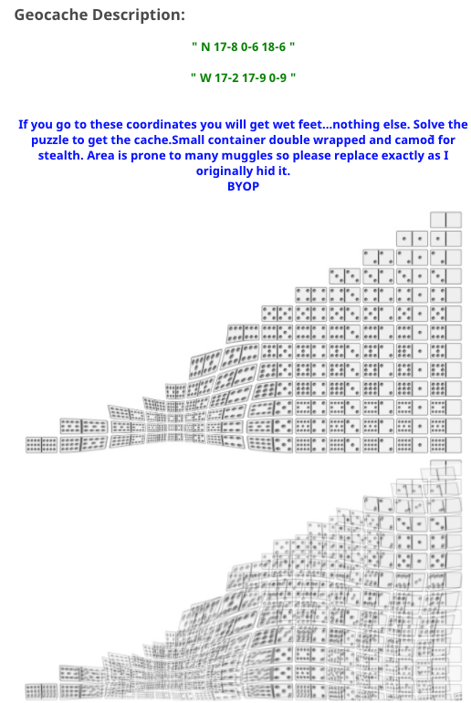
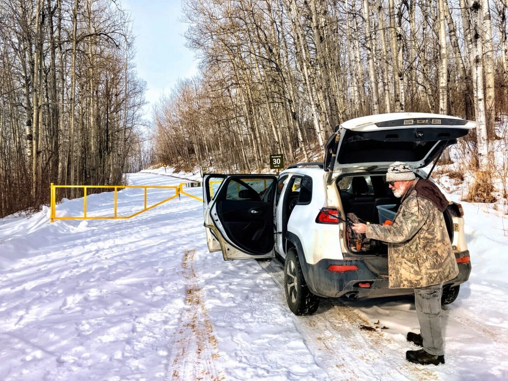
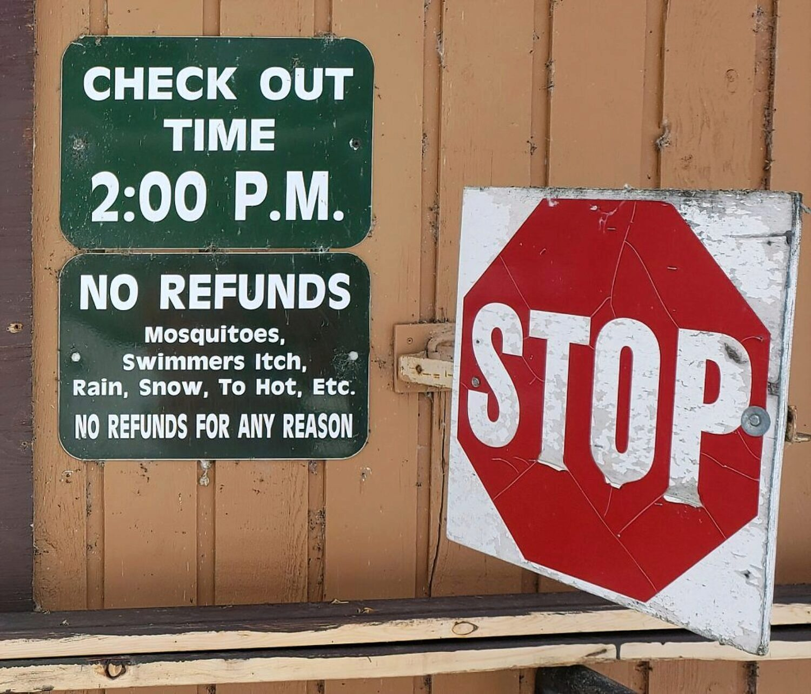
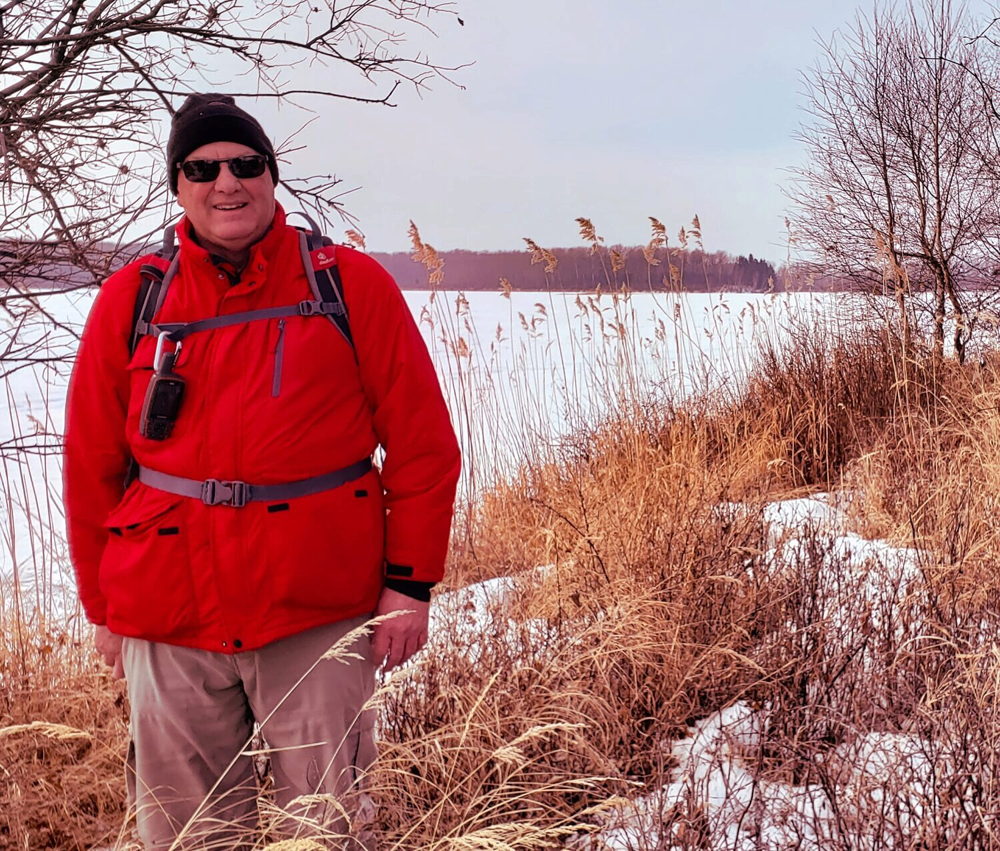

The journey wasn’t a particularly difficult one.

A geocaching buddy Hugh and I trudged across lake ice early in March, 2021 to get to an island on which a “puzzle” geocache was hidden. The story of that experience could be made more dramatic if two of us were hunched over walking into howling wind and pelting snow, icicles hanging on beards and eyeballs freezing in their sockets.

The actual experience was nothing like that, but there’s a story to be told about events well before the day of the journey in addition to the lake trudge experience itself.

Before we get to the actual trudge across the lake, just in case some readers aren’t familiar with how geocaching works, I should start with a short explanation.

### A Short Geocaching Primer

Geocaching is built on a simple concept. Hide something with some sort of “logbook” in it. Record the coordinates of where you hid that thing. Post the coordinates on the [geocaching.com](http://geocaching.com) site.  Other people use those coordinates to guide them to the spot where you hid the thing. They find it, sign the logbook to prove they were physically there and also log the find on the geocaching website.

That’s all quite simple, right?

In fact, it’s so simple, it’s so “open-ended” that it allows geocachers - “cachers" for short - to make the hobby whatever they want it be. 

Cachers can make a cache easy to find after a long walk either down a hiking trail or up a mountain. They can make a cache purposefully difficult hard to find by disguising it somehow. They can make the cache easy to find but hard to get into: for example, some people with a “maker” bent build “gadget” caches that cachers have to figure how to open on the spot.

Some hide “multi-stage” caches that require you to visit multiple stages before reaching the final cache. Usually there are two or three stages, but I’ve done one that is [21 stages](https://www.geocaching.com/geocache/GC5R66F_the-ann-sandy-cross-conservation-area-multicache) and it was well worth the effort too.

### “Puzzle” Caches

Then there are geocaching puzzles. Instead of simply posting where the geocache is hidden, a puzzle cache (the proper name is actually “Mystery” cache) requires the working out of a puzzle in order to come up with the coordinates where the cache is hidden. Puzzles range from straightforward, fun and easy to dastardly, mind-boggling and difficult.

The geocache my geocaching buddy Hugh and I were on a mission to find today was a puzzle cache and **to me**, it was of the dastardly, mind-boggling and difficult sort. It is called “Domino Cache” and the puzzle creator was another geocaching buddy, Dwaine. 

During the pandemic isolation of 2020, to pass some of the time, I focused far more than usual on solving geocaching puzzles. I even spent time solving multiple level, one 10 levels, one 12 levels, one a more than slightly insane 50 levels. So I’m not completely unable to solve geocaching puzzles.

But I was completely unable to solve the puzzle we were going for today. I’d tried multiple times over the years and just couldn’t crack it. I even had very good hints from Dwaine about what to do. I just didn’t get it. 

After I shared my pain with Hugh, who I think it’s fair to say does not love geocaching puzzles, he solved it in very short order! I was so happy and relieved to hear that because I know that someday I had an outside chance to do something I’d been wanting to do literally for years: go find the Domino Cache I strongly suspected and now knew was hidden on an island in the middle of [Thunder Lake near Barrhead, Alberta](https://goo.gl/maps/HpJzXoK9YPFGBha89).

### The Journey to Thunder Lake

We started off trip to Thunder Lake with Hugh leaving his car at my place and setting out in mine. Despite the pandemic, we’d decided to travel together in one car because each of us knew the other was being very careful and isolating as much as possible over the past months.

During the drive from Edmonton, we stopped at a couple of geocaching find most, but not all we attempted. 

Finally it was time to check out how we were going to approach the cache. There was a possibility of simply driving out onto the ice with the car, something we’ve done that at different lakes while geocaching in the past. But when we got to the “dock” at Thunder Lake we saw no evidence of people driving out onto the ice to go ice-fishing or otherwise. There were old “sled” tracks but **no** vehicle tracks.

That made me, the driver, nervous. It might have been just fine to drive out onto the ice. But with no evidence that others were doing it, I wasn’t comfortable being the first.

The next option was to check out places to park and from that spot we’d make our way to the cache. The problem was the places we had in mind were inside the Provincial Park and we found the provincial park was locked up to vehicle traffic for the season.

### The Hike Begins

So we had no choice but to park at the locked gates at the entrance and walk in from there. 

First we had a road to walk on, which of course was easy going. We had a good chuckle as we passed the park registration building. A NO REFUNDS sign, complete with a misspelling, informed guests that no, they wouldn’t get a refund if they didn’t like the mosquitoes, if it rained or if it was too hot or too cold for them. 

The park staff must hear it all!

Soon we were at the shoreline and time to venture out onto the ice. At first there was a little minor “post-holing”: our boots sank into the snow with each step. But in fairly short order that stopped with most of the snow was crusty from being wind swept on the open ice. 

Soon we caught a couple of “ski-doo” tracks which made the walking quite a bit easier and we were able to follow those tracks all the way to the island.

### The Find

Once near the island the map on my GPS receiver hinted that we might need to travel overland for a bit. But as we got closer it was clear that wasn’t the case: soon we were 20 meters away from where the cache was supposed to be.

We found the cache quickly (_Phew!_), exactly where it was supposed to be because both of our GPSr receivers read 2 meters while we standing beside the cache hiding spot. There’s an understood 3 meter margin of error when using these devices so the coordinates we had were obviously precise.

We had found the cache and as is the practice of the times, we each posed for victory photos both during and after the signing of the logbook stored in the geocache container.

The quest for the Domino Cache was completed. It’s **fulfilling** to finally reach a goal, to so something that you didn’t believe would ever happen. Personally, I'd had many "map-dreaming" sessions over the past few *years* wondering if I'd ever manage to come and find this cache. 

And that had *just* happened! 😁

It was the time for periodic “happy dances” to punctuate the trudging steps over the crusty, wind-swept ice back to land and the waiting car. 

## Picture Gallery


