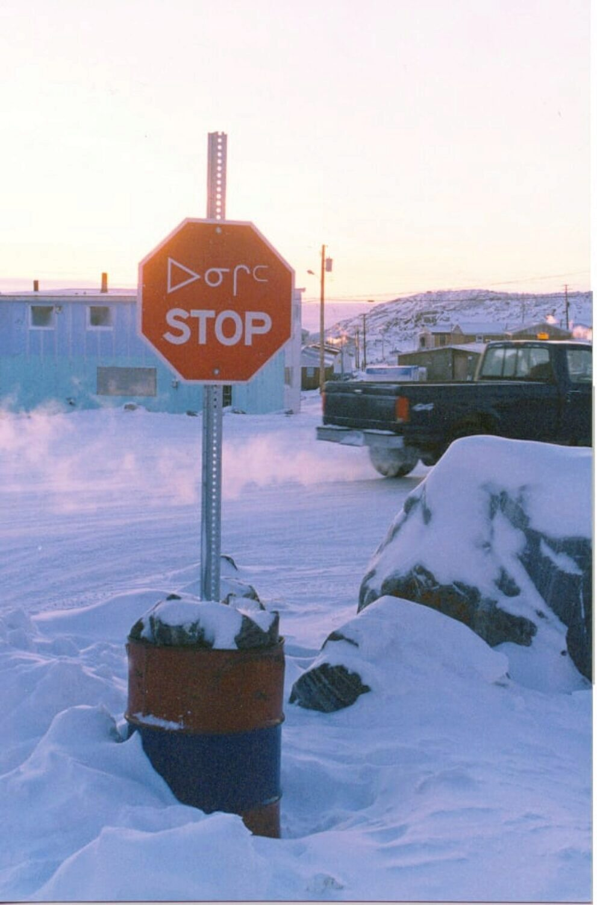

### My 2020 Commentary on this article written in 1998

As the resident "computer guy" during my tenure with Nunavut Arctic College, I got the unexpected, but very welcome, opportunity to travel to other communities that were part of the western "Kitikmeot" region of the College.

This fairly long account covers a work trip I made by air from Cambridge Bay to Taloyoak, formerly known Spence Bay. This was the name I preferred calling the place because it’s the option I had a fighting chance of pronouncing correctly.

And speaking of pronouncing "Taloyoak", I made a minor hobby of asking native inuktitut speakers how to pronounce it correctly. I was surprised at the range of responses I got. Students were at the college in Cambridge Bay from all over the north because some programs were only offered there. Their local dialects rendered this four-syllables worth of sounds - a couple of which English speakers just don't make - slightly differently. This made me feel just a tiny bit better when this native English speaker butchered the pronunciation. 

Incidentally, Taloyoak is the northernmost community on the North American mainland. Remember that when you get hit with the question during your next trivia challenge.

### Why make such a big deal about a trip to another town?

In the post [Traveling to Cambridge Bay](), I wrote about my initial trip to Cambridge Bay. It was a long day, and about as antiseptic as modern air travel can be. On the other hand it was trip in the new, the unknown. The day ushered me into a new reality: a small town north of the Arctic Circle.

And I’ve been in Cambridge Bay ever since. I don’t mean I haven’t moved away from Cambridge. I don’t mean I haven’t gone because of the strong emotional ties to the land. I mean that was August 25, this is November and I have been in the town of Cambridge Bay for the entire time.

I mean, like it or not, I’ve been here ever since because there is **_nowhere else to go_**.

If that statement seems rather final, and perhaps a little harsh, you have to remember that, although I come from a small town in Saskatchewan, in the past I was mobile. I could jump in a car any weekend and travel somewhere to bike, to ski or go shop in the city. I could change my surroundings with the simple act of pointing the car out of town and stepping on the gas pedal.

**_Can’t do that here._**

With the exception of couple of brief trips on an ATV, I have been in the confines of the town since I got here. It isn’t the cold that keeps me in, nor is it the lack of time or inclination to travel. It’s the vast expanse of The Land and the lack of good transportation to travel over it that keeps me here.

I’ve been calling this confinement and its effects the **fish bowl mentality.** You can swim around and around and pretend you see life from different depths and angles and for a while exploring the fish bowl is fun. There are the pretty rocks on the bottom. There are other fish to meet and there is the routine of regular feedings. But after a while the novelty wears off of things like the fake diver standing beside the plastic chest blowing up the bubbles. It’s not that you don’t like it; it’s just that you want to get the chance of looking at something else, changing your perspective.

On Monday, November 17 I got the chance to change my perspective.

### There Was a Job to Do

Cambridge Bay is the main campus of the Kitikmeot Region of Nunavut Arctic College. There are five “sub-campuses”: Kugluktuk, Gjoa Haven, Holman, Pelly Bay and Taloyoak. Having worked for a Regional College in Saskatchewan, I am quite used to the idea of large distances between College offices. We used to think travelling an hour and a half to get to one of our offices was a big trip. But three hours in a plane to get to another office is something else again.

Here’s why I was going. The six computers used in the small lab in Taloyoak needed new hard drives. Another fellow who works for the local Health Board was good enough to try to install the drives on a trip through town, but he had trouble with them and didn’t have the time in his schedule to spend musing on what the problem might be.

The job still had to be done, so I was asked to travel to Taloyoak on Monday, November 17. Once I got there, the next plane back out to Cambridge Bay would be Wednesday, November 19, so had about a day and half to do the job. Normally this would be plenty of time, but I was a bit apprehensive because of the former troubles getting the job done. I parked all the tools and software I could. I made boot disks, and tested the procedure on a test computer before going. I thought I was ready, but I the computer fix-it business, who ever really knows what’s going to come up. In fact, I coined a phrase during this job that I’ll probably use for the rest of my life. When it comes to dealing with these beasts: "No promises; no predictions."

### Leaving Town

On the way out of town I picked up a care package requested by the College folks in Taloyoak: the biggest bucket of KFC chicken I could get there. I also was serving as a mule to carry cheques for another government agency to take to Gjoa Haven and Taloyoak. I got to the airport about 45 minutes early for a 12:30 departure.

And I waited.

And waited some more.

It was noon and I was hungry. I’d done everything to get ready except eat. Then I remembered a small package of caribou jerky I’d stuck in my pocket after the charity auction the weekend before. I ate the jerky slowly and, man, it really hit the spot.

Author’s note: On the way out of Cambridge Bay, we flew over my house. Weeeee……

### The Flight OUT

The flight to Taloyoak was a milk run kind of affair with stops in other communities, Gjoa Haven, and Pelly Bay. The airline was FirstAir. Apparently it has a reputation for landing and taking off in any kind of weather and in this climate what choice would they have, really?

I’ve forgotten the model number of the plane. It had two props, ample room for cargo in what would normally be the first class section of the plane and sat about 30 people (I would guess) in the rear.

The thing that struck me the most about the plane flight was the complete absence of gloss. No gloss here. On a commercial airline you expect to fly in womb-like comfort in an antiseptic environment designed to gloss over the animal herding incident that a plane flight really is. There are antiseptic seats, antiseptic noises and antiseptic diversions like today’s paper and headphones twinkling out elevator music. Some of these things were present on this flight: sure, we had seats, there were papers to read (News North and a Toronto Globe and Mail that looked ridiculously out of place), and there were things to eat.

But the entire experience was different. When the props revved up, the fuselage rattled and when you glanced at the rattling fuselage, you noticed the dented vents and the peeling paint. The flight attendant wore a jumpsuit, the kind you’d see on a jet pilot with zippers on the sides, back and across the chest. (Was she just dressed that way to be ready to jump out quickly?) And the food offered was all pre-packaged snack food. The people from the Christie company would be very pleased with the contract to supply this airline.

This was the reality and who could expect otherwise? With the extreme conditions, a person doesn’t expect frills. Think of how silly it seems to be transporting a grand piano by canoe to a new settlement. It just doesn’t fit in. Well, niceties and frills and fluff just don’t fit in here.

On the day of the flight the sun was setting at about 1:45 in the afternoon. The first leg of the trip to Gjoa Haven started in the light and gradually grew dark as we traveled East. The sun was orange on the horizon and it was a beautiful sight.

The ghost of the grand piano was on the plane though. It spoke to me. The French flight attendant would announce the safely regulations and again in English with a heavy French accent, and then a recorded voice would announce the same thing in Inuktitut, I assume. All this was squeaking out of tiny speakers that almost physically hurt my usually deaf ears.

That is all fine and dandy, but at seemingly random intervals a pre-recorded voice would announce something about the seat belts in a game show host voice that seemed completely out of place. Out of the blue a homogenized, filtered, groomed Bob Barker voice emits out of the squeaky larynx of the rattling old bones of the plane. An alien voice in this environment, and it was just tad bizarre.

### Landing in Gjoa Haven

When the announcement came that we were landing, I naturally looked out of the window anticipating the earth would be appearing larger and larger as we descended. No earth. We had descended into a cloud and the cloud didn’t seem to want to let go of the plane.

Still no earth.

I looked back at the newspaper I was reading. After about a minute there was still, you guessed it, no earth. I remember thinking "Land already!"

Then the ground appeared briefly and the pilot was still making corrections on the approach. This made me nervous. We touched down with no incident and then I realized what was going on. We were in the middle of a snowstorm. The snow screamed down the runway and gave me the illusion that we were still flying.

Everyone is required to leave the plane during refueling so we got a taste of the storm we’d just landed in. It wasn’t cold at all, but it was amazing that we had landed in this snow-filled soup. "Unbelievable," I said out loud a few times both in and out of the airport waiting room.

After the stay in the airport waiting room, after talking about the weather and musing about the pilot’s sanity, we took off amidst a definite murmur amongst the passengers. Would we make it or not? 

As it turned out, no problem. We lifted slowly off the runaway and the tundra melted into the darkness below.

### On to Taloyoak

After about a forty-five minute flight, we landed in Pelly Bay. After a 15 or 20 minute wait, we continued on to Taloyoak. The flight took about 30 minutes this time. I got off the plane and wondered if the box with my tools and software had really followed me. I would be picking my nose and talking to the wall for two days if it didn’t. It was there.

While in Gjoa Haven I met a couple of guys, Robert and Gary, who worked for the Power Corp. I’d met Robert, a Newfoundlander, in Cambridge Bay just couple days after he’d arrived in town. We made fools of ourselves on opposing teams of a hotly contested charades game. Anyway these guys were getting picked up by a Power Corp co-worker and invited me to travel into town with them. Louie, a great guy originally from Gjoa Haven, welcomed us and after we got our stuff (it did get there) we made our way into town, about a 2 km drive. We were all going to the same place, the Boothia Hotel.

### Ah, the Boothia Hotel...

I had a $120 / night room (plus $60 for meals) with three single beds in it. That's not a ridiculous hotel home charge these days, but remember, this was 1997. $120 was _expensive_! The room had a disabled sink, cupboards full of hotel supplies, soup, Kleenex etc, and a small 14" T.V. with no channels to watch. Notice I didn’t mention a bathroom? It was down the hall a bit.

Later that night I found that this room was also…HOT! It was so hot I couldn’t sleep until 3:30 a.m. the first night. I’m staying in a hotel above the arctic circle and I’m complaining about the heat. Go figure. Actually there was a Yin / Yang to this: Gary, one of the Power Corp. guys was in a nearby room and he was freezing the first night, so much so that he opened his door into the hallway just to let in some warm air.

While on the topic of sleeping, I should skip ahead to the second night. I was suddenly sharing my room with someone else. A fellow asked at the supper table (at which guests are fed a $30.00 supper) "Who is I Room 3?"

"That would be me," I said.

"I snore," was the first thing he said.

"You’re looking a man frown deeply," I said.

I have traveled before. This ain’t my first time. I’ve slept on floors of boats crossing the English Channel, in youth hostels in Europe, Canada and Japan. And I really can’t stand snoring. I have learned to ALWAYS take ear plugs with me when I travel, just in case. Well do you think that I remembered them as I looked forward to sleeping in my $120 / night room? NOPE.

That night he snored. I was dog tired from a big day’s work and not having slept the night before and I’d taken a sleeping pill to make sure I got my sleep that night. But that night he snored and I woke up four times throughout the night, even after being "drugged up" with a sleeping pill. At the five o’clock waking I got my pants on rather noisily to wake him up and informed him curtly he was snoring. He was a very nice man, and was very apologetic and we actually joked about the whole matter at breakfast. But, in a way, I guess this paragraph is my revenge. Maybe this goes to show you "The pen is mightier than the snored." _apologies for that_

### Doing The Job

Backing up a bit, the work during the day went very well for the most part. After an initial hour and a half of torture, the computers started to behave and fall into a routine of being upgraded with hardware and software. I was very happy with how things went in Taloyoak. I actually had to THINK, experiment and use some problem solving abilities to get the job done. I actually felt fear when things didn’t go right during the first part of the morning. This made what turned out to be a successful job so much more satisfying in the end.

Taloyoak as a town was very interesting. I could tell things were more traditionally Inuit there. Stop signs were in English and syllabics. My new face was definitely noticed as I walked to the Co-op with Denise Ouellet, the Office Administration instructor. I remember three different kids coming up to me and saying "Who are you?" or "What’s your name?" All in all, as a white person I felt more isolated in the town. This maybe isn’t a fair take, but those were definitely my feelings during the short time I was there. It shed a little light on my experience in Cambridge Bay, because Cambridge, I realized only now, had much more white influence everywhere.

The town of Taloyoak was built around two bays and the terrain is hilly and rocky, a big difference from Cambridge Bay. The sun was setting during the noon hour and the sunsets were really beautiful with the rugged rocks of the bay in the foreground.

If you look at these images and see a pretty but not too spectacular sunset, you might think, "So, what?!" But remember I took these sunset pictures just after 12 noon that day.



As I was leaving town I was given a ride to the airport by Louie, the same kind soul that drove his Power Corp. co-workers and me into town from the airport. Louie and I somehow got into a 10 minute conversation about racism. It was interesting to talk to such an open person.

### The Return

The flight to Cambridge Bay was direct and, really quite uneventful. I sat beside a fellow who worked for the cable company and had been in Pelly Bay for the last two months, away from his family, I gathered. He talked about doing pole work, but he was hardly dressed for the winter though. He was going to Yellowknife, then Edmonton and then east to Iqaluit. I mentioned that it was going to be a long hard trip. "I don’t mind," was the understated answer. **He wanted OUT**.

When I left Cambridge Bay, I felt like I was getting out of jail. When I returned, for the first time, it felt like I was returning home to a place of familiarity at least. That night I slept in my bed, had a bath in my bathtub ate my food.

It was good to be back.

