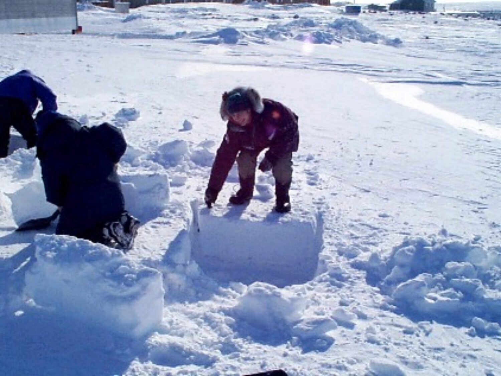
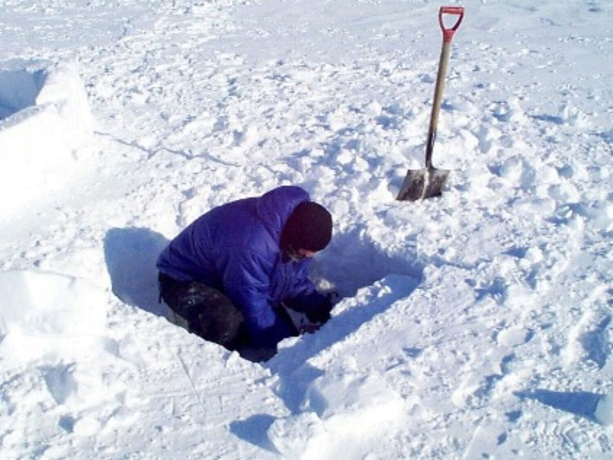
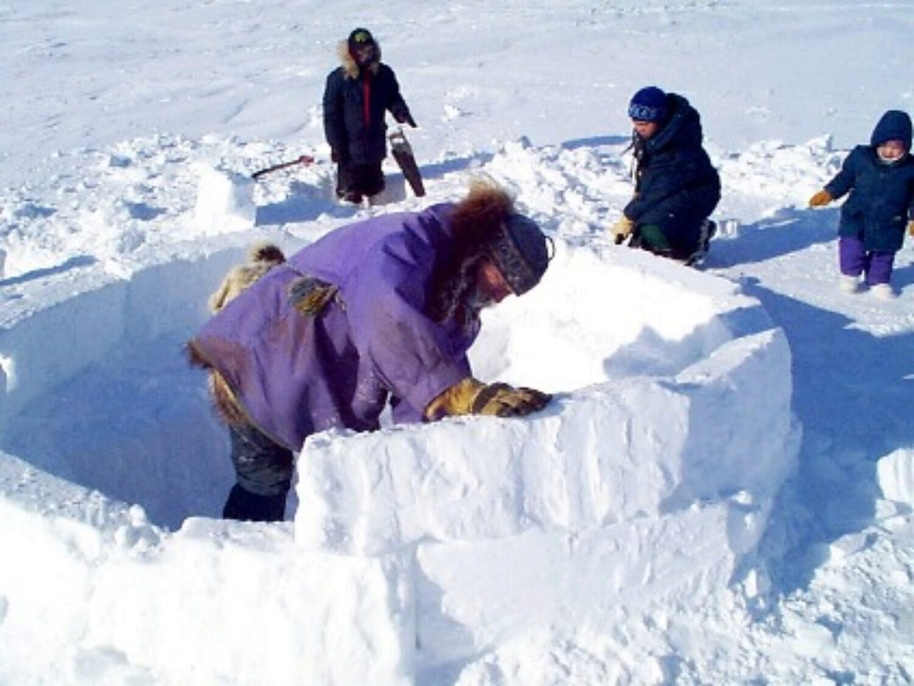
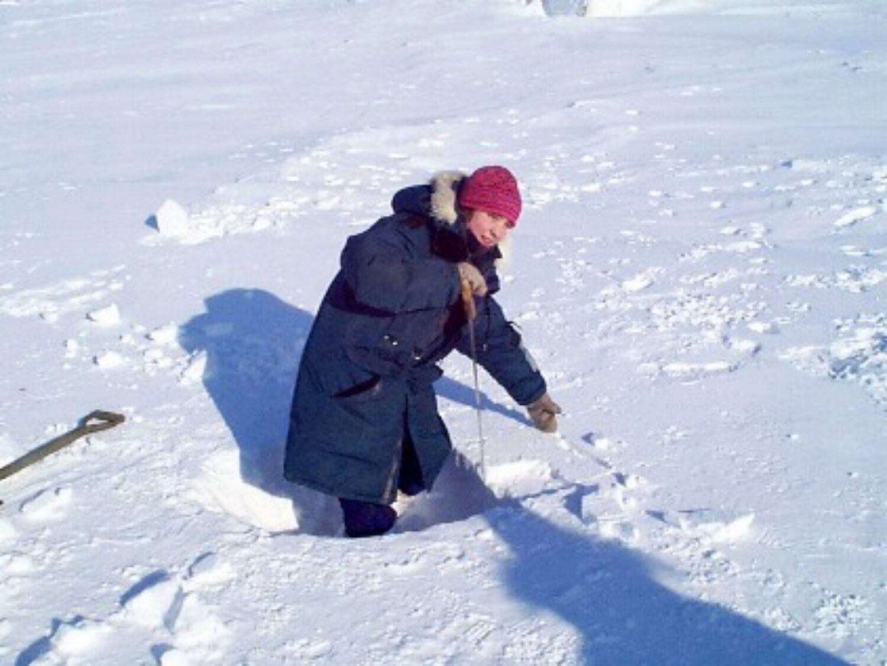
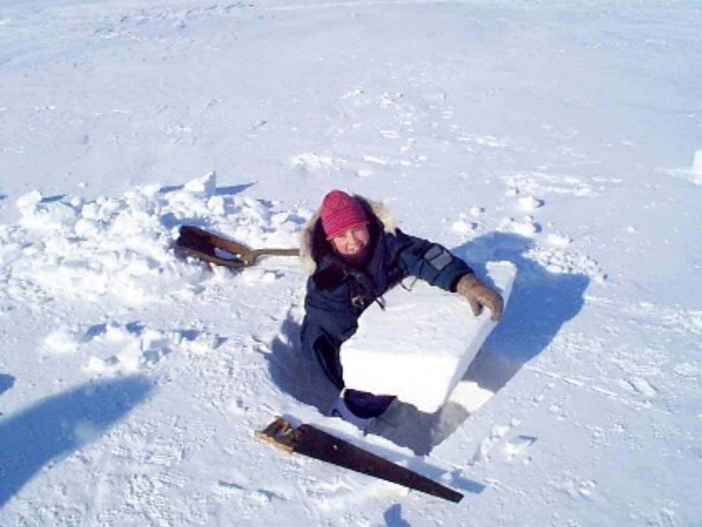
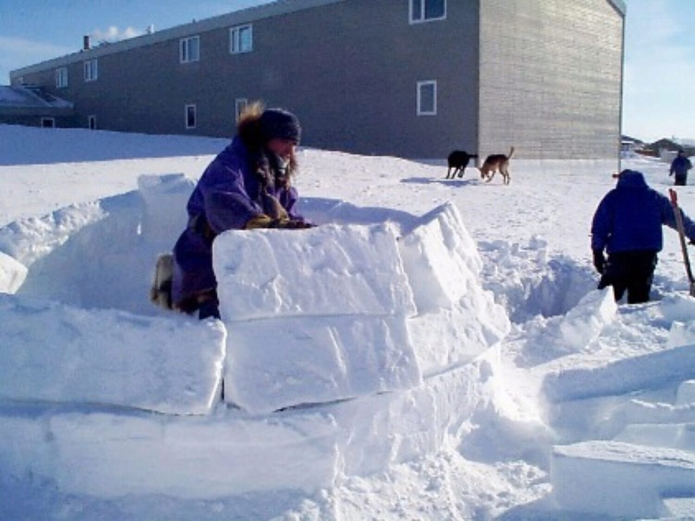
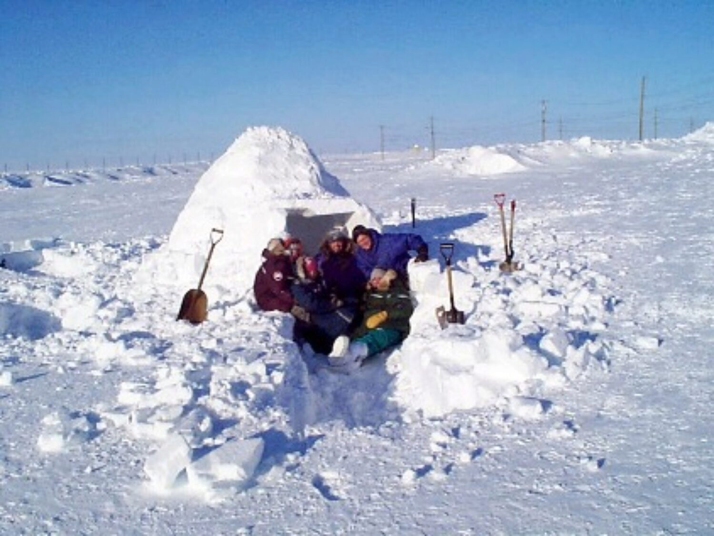
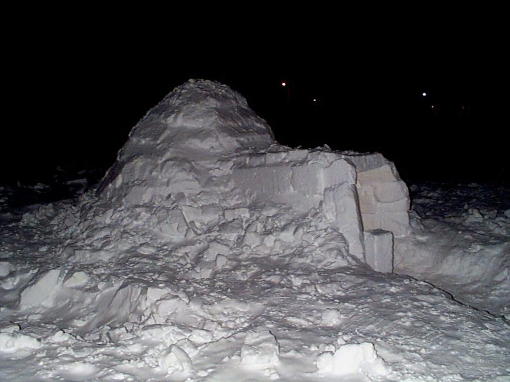

### My commentary in 2020

Helping to build and later sleep in an igloo still remains a strong memory from my time in Cambridge Bay. After all, it’s not a common thing to be able to do anywhere south of the arctic. In the original version I included everyone’s family name, but I’ve decided to edit those here just in case privacy is a factor for those involved. 

The real reason we were able to get an igloo built at all was because Doug S. knew the skill and art necessary to construct one. The rest of us just cut snow blocks for him to do his thing. Doug was originally from the Toronto area (I believe) and lived pretty much like a traditional Inuk. He seemed to knew more about the traditional Inuit ways than any of the younger generation. I honestly forget the level of gratitude for his work that I had at the time, but I certainly feel the gratitude now. Thanks Doug for making that memorable experience a reality way back on the day in late March, 1998!

My original post was essentially a short series of digital images with short captions beside each. That’s the format I’ll follow here.

On March 22 a great group of people got together to build an igloo. This was a first for most of us and it was truly a fun time. We built a snow house and maybe some new friendships too.

 was the brains of the outfit.")

