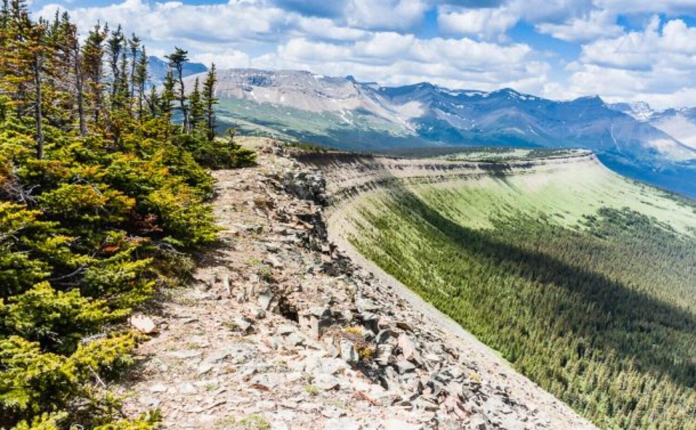

It was only a week ago I'd even heard about the Cardinal Divide, which is south and west of Hinton, near Cadomin. It's a "divide" because on one side of it, water flows north and eventually empties into the Arctic Ocean; on the other side the water flows west and eventually empties into Hudson's Bay.

My goal for the day was to climb the modest ridge, and walk along it for about 3 kilometers to find a survey marker (some, like this one, can be logged as geocaches) and a nearby geocache. The weather was excellent and the only worry was getting too much sun, so I slathered on sun screen (no mosquito repellant needed, thank goodness - the noon sun and strong winds kept them at home I think).

This was a really unique ridge to walk along. It was so impressive to see it curve out into the horizon and on the edge see the gradual, saw tooth disintegration of the ledge.

I made it to my goal, had some lunch and then made my way back both losing and gaining elevation along the top of the ridge, until I followed the approach trail and back to the parking spot.

It was a great experience and I highly recommend the visit to anyone.

### **Tips:**

**Park at N52 53.682 W117 14.856**. The road is rough for the last 8 km or so. My mid-sized sedan made it and there were others like it at the parking spot, but the majority of vehicles, rightly so, were trucks and SUV's with lots of clearance.

### Location

<iframe src="https://www.google.com/maps/embed?pb=!1m18!1m12!1m3!1d9432.196502506564!2d-117.2541668406708!3d52.897445397409!2m3!1f0!2f0!3f0!3m2!1i1024!2i768!4f13.1!3m3!1m2!1s0x0%3A0x0!2zNTLCsDUzJzQwLjkiTiAxMTfCsDE0JzUxLjQiVw!5e1!3m2!1sen!2sca!4v1594789904506!5m2!1sen!2sca" width="100%" height="600" frameborder="0" style="border:0;" allowfullscreen aria-hidden="false" tabindex="0"></iframe>
