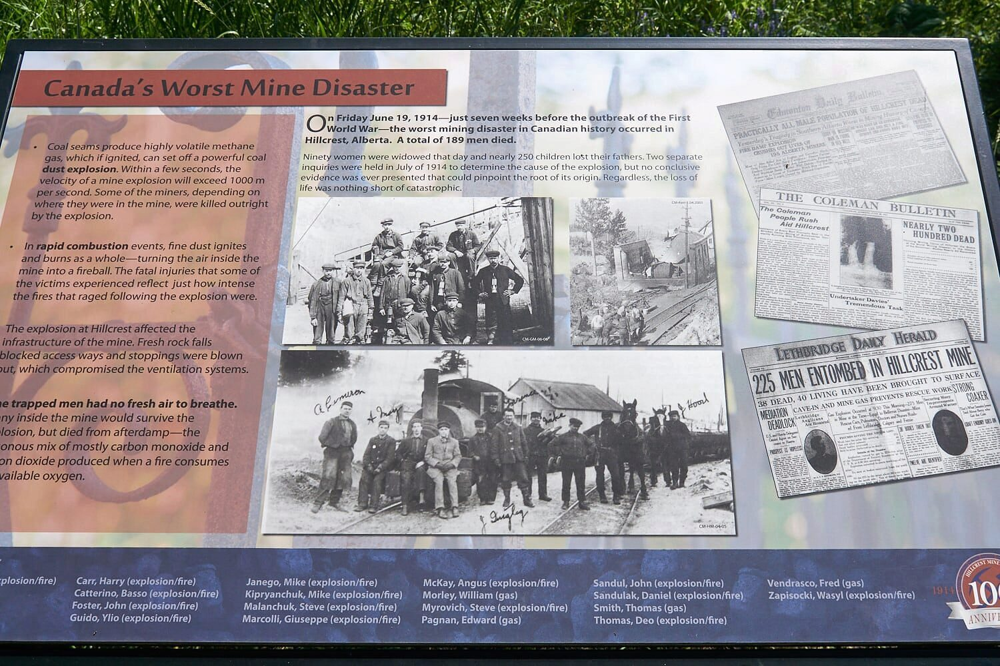

Hillcrest Cemetery is located in Hillcrest, Alberta (also known as Hillcrest Mines), and is a large sprawling place. The images below don't do justice to the number nor the variety of different types of grave sites in cemetery.

The event that naturally overshadows one's visit is the Hillcrest Mine disaster which occurred on Friday June 19, 1914. At 9 am that morning, a pocket of methane gas in the Hillcrest Mine ignited, which set off a larger coal-dust explosion. 189 men died as a result. It was the worst coal mining accident in Canadian history and at the time the world's third worst mine disaster. ([source](http://www.crowsnestheritage.ca/attractions/hillcrest-mine-disaster-and-memorial-cemetery/))

Most of those men who died in the disaster were buried in two mass graves in the cemetery and it is sobering to find out these deaths made up almost half the mine's workforce and 20% of the community's population. ([source](https://en.wikipedia.org/wiki/Hillcrest,_Alberta))

The effect of the disaster would have reverberated in families around the world because of the 189 men, 17 were born in Canada and of those only 2 in Alberta. There were sizeable numbers from England, Austria and Italy. ([source](http://hillcrestminedisaster.com/))

A large, black memorial to the disaster is the first thing you encounter when you arrive and the magnitude of that tragedy lingers throughout your visit. Information placards in the area so an excellent job of explaining the history of the disaster in detail.

A website dedicated to the disaster suggests that, despite its magnitude, it has been "forgotten," probably because World War I was declared nine days after it occurred.

### Gallery - Cemetery Grounds


### Gallery - Gravestones


### Location

<iframe src="https://www.google.com/maps/embed?pb=!1m18!1m12!1m3!1d1481.329797104026!2d-114.38084439912274!3d49.57509018354054!2m3!1f0!2f0!3f0!3m2!1i1024!2i768!4f13.1!3m3!1m2!1s0x0%3A0xc99b8c427bd2180b!2zNDnCsDM0JzMwLjMiTiAxMTTCsDIyJzQ3LjAiVw!5e1!3m2!1sen!2sca!4v1649193019546!5m2!1sen!2sca" width="100%" height="600" style="border:0;" allowfullscreen loading="lazy" referrerpolicy="no-referrer-when-downgrade"></iframe>

### Sources:

- [http://www.crowsnestheritage.ca/attractions/hillcrest-mine-disaster-and-memorial-cemetery/](http://www.crowsnestheritage.ca/attractions/hillcrest-mine-disaster-and-memorial-cemetery/)
- [https://en.wikipedia.org/wiki/Hillcrest,\_Alberta](https://en.wikipedia.org/wiki/Hillcrest,_Alberta)
- [http://hillcrestminedisaster.com/](http://hillcrestminedisaster.com/)
