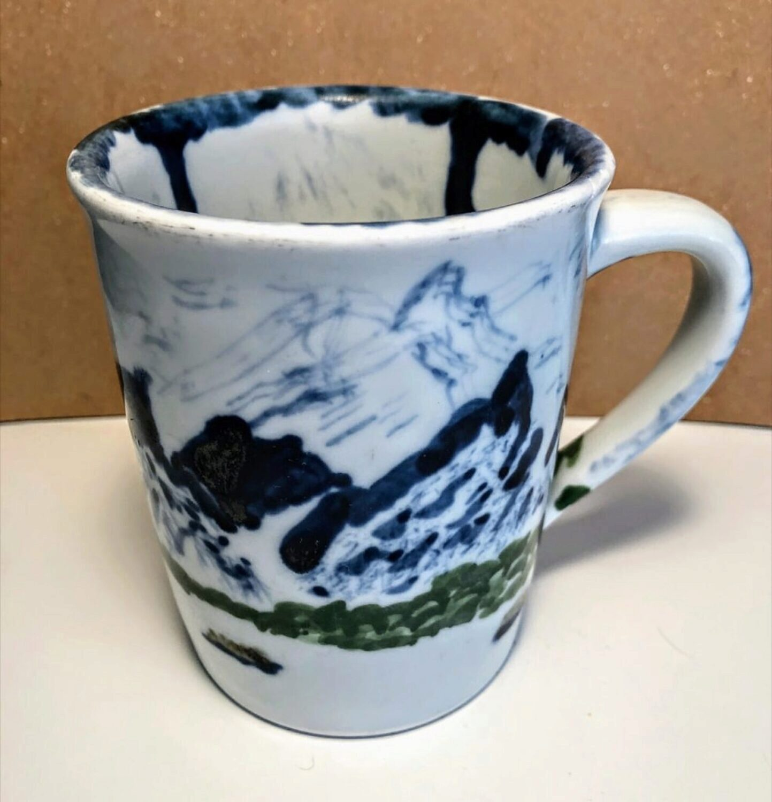
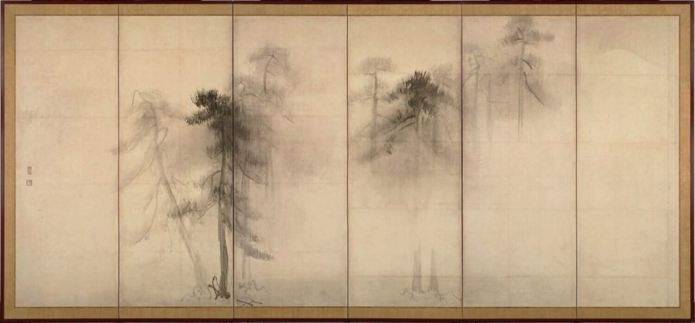

It’s over 35 years old now. These days it’s not my first or even second choice when it comes to choosing a coffee mug in the morning.

But the mug I painted up with glaze to be fired as a souvenir from Tobe, Japan still tells me an important truth when I free it from the darkness of the cupboard. 

Here’s my mug from Tobe. 

You calling it ugly? That’s okay, I can’t disagree very strongly. 

Marin Burch, the principal of the English conversation school in Matsuyama Ehime where I’d just started working in the fall of 1985, drove a group of us to nearby Tobe to try out painting glaze on plain, blank, unfired pottery mugs.

Why Tobe? Because it’s a town that has been famous for [a style of blue and white pottery](https://en.wikipedia.org/wiki/Tobe_ware), called _sometsuke_, since the 1700’s. 

Our group of budding artists consisted of Aya, Marin’s teenage daughter, Kirsten from Tacoma, WA, another teacher already working at the school, and me, the “new guy” from Canada.

When the time came to paint glaze on the blank mug, I distinctly remember a moment of panic. “What? Me an artist?” I searched my brain for any similar past experience to build on. Nothing. The brain was a blank as the mug I was holding up to paint.

I vaguely remember there being pictures hanging about the pottery studio and I chose one to copy: a Chinese-style ink brush painting of misty mountains towering up over a lone boat on a meandering river. That’s what the squiggles you see on that mug are **trying** to be.

But the urge I remember most vividly from that painting session is that I felt I had **_fill up all the space_**. Leave no blank spot untouched! It was a kind of “I paid for the whole mug, so I have to paint on all of it” urge.
***

Now fast forward to almost two years after that painting session. My teaching contract finished, I was packing up to leave Japan to return to Canada. Of course the souvenir mug I painted in Tobe was returning home with me.

It was only then I had an intense realization. After two years of living in Japan, if I were to sit down and paint the same mug, I would have painted it with an entirely different aim. The urge would **not** have been to fill the space up, but leave as much open space as possible. 

An artistic sense of appreciating negative space had quietly infiltrated my brain by some invisible cultural osmosis.  After two years in Japan, the ink brush painting below is the kind of thing I would have wanted to imitate.

Of course my lack of artistic skill wouldn’t have rendered anything close to this, but the point is my idea of beauty had changed after having been immersed in the Japanese culture.

It’s not like I was focusing on any “artistic” theories during that time. Far from it: I was just living day-by-day, teaching English conversation, and when I was able, taking trips to a few places around Japan like Kyoto, Kyushu and Tokyo to name a few destinations. There was no conscious study of aesthetics whatsoever.

But living immersed in the Japanese culture had altered my brain. And it had altered by brain silently, with no warning. It was that invisible re-wiring of my brain that came as a complete surprise.

In contrast, it was easy to see my behaviour had been altered in day-to-day life. When living in a foreign culture it’s “do as the Romans do”: one molds oneself to fit in with the “flow” of the culture. One obvious example is the language of personal interactions that becomes become part the daily routine. 

For example, one wouldn’t dream of asking someone to do something without adding an ”おねがいします” （onegaishimasu - translated “Please do it for me” or simply “Please”). Months after returning to Canada, I was still muttering this phrase under my breath while asking for a favour from someone. 

In Japan, I couldn’t finish a class and return to the office without someone bestowing a “おつかりさまでした！” on me as I entered the room. “Otsukarisama deshita” translates variously as “Good job!”, “You must be tired”, “You worked hard!” 

These common expressions serve a cultural “grease” that make for smoother group interactions. It was obvious to me they were changing my behaviour because they were being repeated every day. 

But during my every day interactions with others no one was attempting to influence my personal aesthetic, my touchstone for deciding what was and what wasn’t artistically beautiful. No one once mentioned  “negative space” during my time in Japan. That aesthetic simply surrounded me without me even noticing.

The saying “Fish discover water last” comes to mind. My version has always been “A fish is the last creature I’d ask for a definition of water”. To a fish, water just is. How do you notice, much less question, what simply is?

My ugly mug reminds me that I once swam in a pond that contained a different kind of water. And it changed me.
