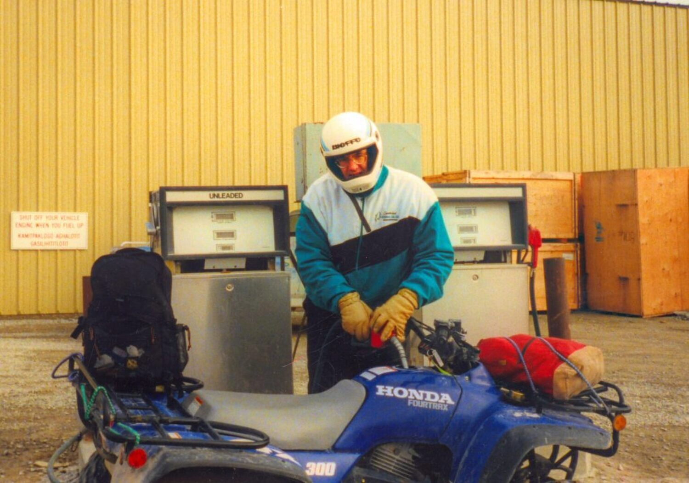
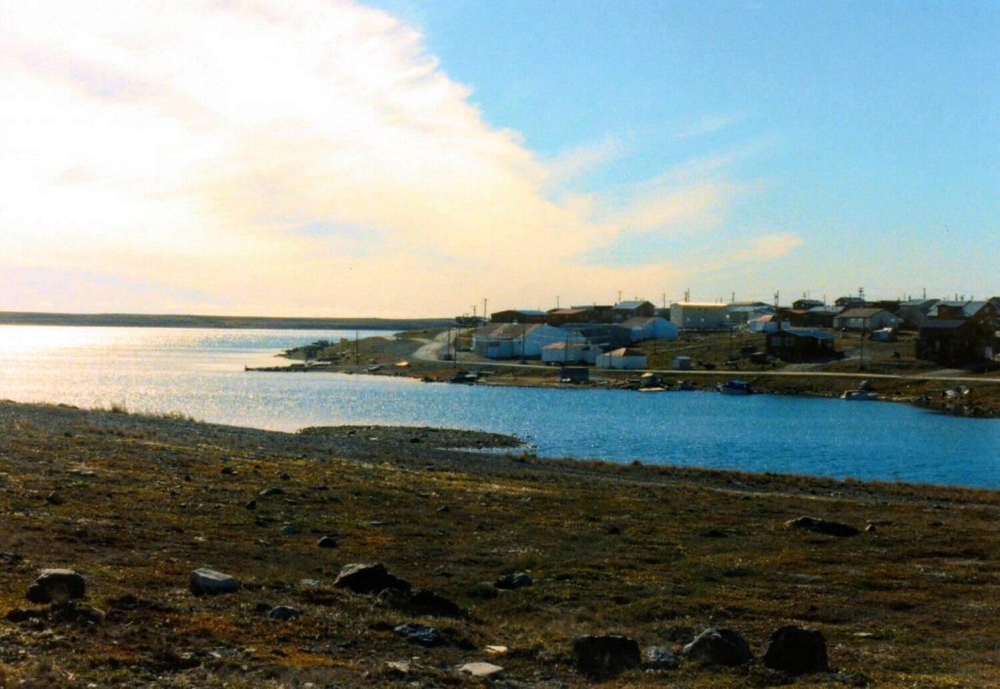
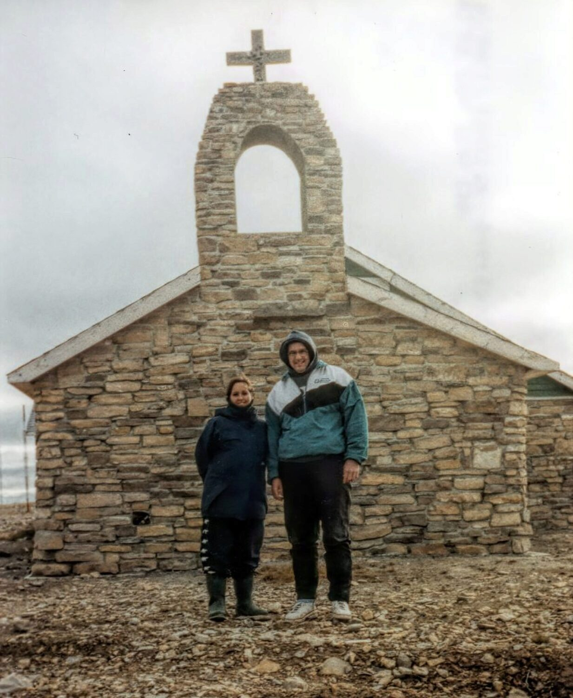
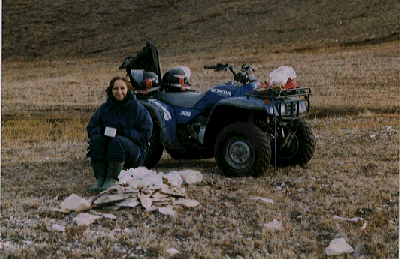
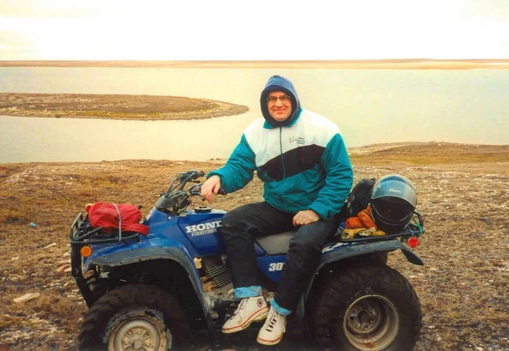

### My commentary in 2020

During my time in Cambridge Bay, I was able to borrow someone’s all-terrain vehicle (ATV, but we generally call them “quads”) only a few times. This page on the website was about the first time I was able to venture out of town on a borrowed machine and that made the "get out of jail free" trip so special. 

> The local description for traveling away from civilization onto the arctic tundra is going “**out on the land**.”

Saturday, September 6 was a big day for me. It was the first time I had the chance to venture out of town onto the tundra with a vehicle. Quads and of course snow mobiles (we generally call them “sleds”) are a fixture here. Young reckless drivers use them to roar noisily down the streets; mothers and dads use them to transport their kids and "stuff" around.

I didn’t understand the power and the necessity of these things until today.

Danielle M., a co-worker, had had the opportunity to take a trip a week before and came back raving about it. She said she was hooked, that she loved those quads, that she had to go again. I listened and couldn’t help feeling happy for her fundamental excitement about the day. I was also really jealous and told her so. I wanted - needed - to take a trip out.

Understand, at this point I didn’t think I really needed to escape town. There was no hustle and bustle of city life to get away from, no rat race of human kind. It wasn’t escaping the bright lights of the big city. Heck, some of the brightest lights here are the lights that flash when you open the fridge door. (I guess that’s why I’m drawn to mine so often).

No, the need to get away was more of a quiet knowledge that this little blip on the tip of a huge island in the Arctic Ocean called Cambridge Bay was not even the beginning of a representation of the reality of the world around me. That reality was surrounding the small town and the only real glimpse I’d had of that was the five minutes I’d seen when the plane landed when I first arrived and a short walk out of town one afternoon.

I knew I wanted to take a trip out and Suz B., the Office Administration instructor, hadn’t had a chance to see the outside of town yet either. Vicki B., our part-time boss, benefactor, and mom kindly lent us her quad and a helmet. After using a bike pump to give a slow leaking tire some air and then a fill with gas and some serious compressed air and some needed helmets loaned by Nicole and Howard B., we were ready to venture out. I drove with Suz hanging on (for dear life) on the back of the seat.

A part of me wants to ask you to hum the opening riff to “Born to be Wild” right now. But really I wasn’t too wild. I’d driven these things before on a friends farm. I’d even driven the three-wheeled kind that were eventually banned because they were so inherently unstable and dangerous. 

But it was the first time I’ve driven one of these things while having another human life other than my own to worry about. There was a bit of a learning curve, but after a couple of silly gear shifts, I had the hang of it.

It only took about ten minutes of driving to realize that I really felt FREE. 

Despite what I said about the urge to go out of town NOT being to escape town, I suddenly realized that part of the joy really WAS escaping the town. What’s with that? There on the tundra is a town of about 1400 people, about 30 of whom I have met. And I have the urge to get away from it? Now this must be come basic kind of urge inside of me. I didn’t feel at all cooped up anymore. I was FREE!

The goal was Mt. Pelly, a large hill north of Cambridge Bay.

About 10 to 15 minutes ride out of town I spied a couple of brown shapes off to the right, and after a half minute more, I was sure. We were seeing two musk-oxen about 500 yards away. Now, realize that I have never in my life written the phrase “two musk-oxen” much less seen the creatures, so this was a treat. We went off the road and I had my first experience driving on the true tundra.

The ground varied quickly from jutting rocks to green pools of swamp to suspiciously lush grass circles that looked like you could disappear into. I circled behind a ridge, found a fairly level section to climb it and slowly maneuvered the quad toward the musk-oxen. We could see them about 200 yards away - I would guess - on the other side of a crystal clear pond. Suz and I walked down to the pond with our cameras. I also took my binoculars.

Walking across the ground made me forget about the animals staring at us suspiciously from their spot across the pond. The rock was surrounded by pillowy mounds of muskeg. It was such a strange sensation to step on rock and quickly to a soft foamy substance that was the earth. Lichens covered the rocks in colours from bright oranges to yellow-greens to green and black. Then at the lake the design of the reddish rocks under the clear pond water distracted me again. Apparently I’m easily distracted. The design was beautiful and it was well...just...there.

Suz has a 75-200 mm zoom lens, so she took the pics of the musk-oxen while I spied them through my binoculars, which gave a great close up view. I must admit, they are strange looking animals. I had touched a muskox hide the day before in town and knew the outer wool was fine like human hair and closer to the skin it was even more fine. Their horns curled around the sides of their head and large tufts of furs bunched up behind their heads.

Both were stone still. Each stood and stared at us intently, but didn’t move the whole time we were there. It was a neat experience to see these animals. We’d heard that we wouldn’t see any because they were already gone from the area. These two had forgotten to leave it seems.

Suz - This small, dark image is all I had from the original website  

Back on the road, the next sights were the little shack tents and cabins built close to the road to Mount Pelly. To someone from a city, not used to wide open spaces, an image of these little structures might mean loneliness. But what struck me about them was the diminutive size of them in relation to the treeless rock and muskeg and rocky earth around them. They seemed to be a good symbol of where man really stands in this environment.

Along the road too were small piles of rock, probably built to pass the time. Some were simple pillars of one rock on another. Others were more elaborate markers. The rock piles that were built up in the shape of human beings are called Inukshuks and are now an international symbol of friendship.

Suz and I went to the far side of Mount Pelly because that’s where the road lead (rookies!). After the path got too treacherous and wet and muddy, we turned around and stopped at the foot of Pelly overlooking a small lake with an island just off the shore. A rock fire pit had been use there before, so we were by no means the first people there, but it was very nice spot. We broke out the hot chocolate that Vicki made for us, broke out the cookies that Vicki made for us and also some bread with cream cheese I brought. Suz’s peanut butter sandwiches are squashed out of all recognition by this time.

It tasted SO good.

After a bit I climbed up the hill to see what I could see. All along the side of the hill were holes under rocks that I assume now were lemming borrows. At the the top of the the third plateau I stopped and truly looked around.

It was a different world from here. I didn’t know if it was a land dotted by lakes or lakes dotted by land. The sun was straining to get out at this point, so the light changed the view almost every minute. Standing on this large hill, looking across the tundra made me feel small. What I saw was grand and powerful just by being there. The petty worries I have throughout the day, I now associated with being inside four walls, cramped like the cramped thinking it is. All that was so small compared to the size and power of this sight.

Suz and I started our journey back to town after gathering a small rock each from Mount Pelly, and a couple of feathers I found snagged to the grass. We made a few stops on the way to take pictures and to pick up a piece of muskox fur laying on the ground just off the road.

Getting back to town was a strange experience. I smelled humans again: garbage smoke and some fuel in the air. On the other hand, for the first time I felt like I was returning to the comfort of HOME.
