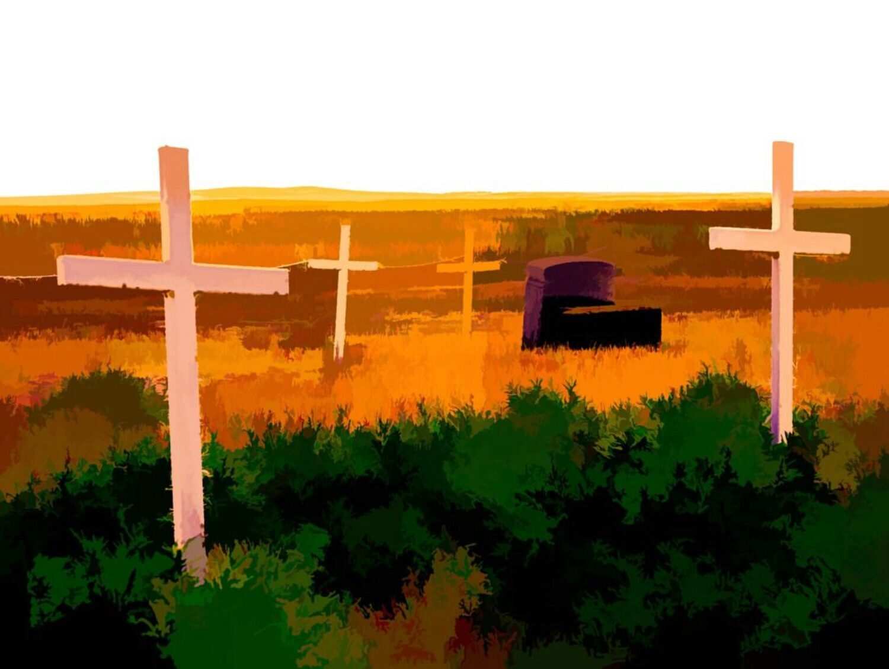

There is very little information online about Prospy Cemetery save what is inscribed on the large cairn on site. William Jasper Hackworth donated the land for the graveyard in 1914 where his wife was buried that same year.

The images from this cemetery are few. But when post-processing I had a lot of fun taking one image in multiple different creative ways. Each of the results speaks to me in a different way and I couldn't find any I was willing to discard.

None of the images of the single, skewed cross bears any resemblance to what the object looked like in real life. It has been enhanced, dressed up and presented in different ways, each evoking a different reaction.

The image isn't pretending to depict how this single cross really looked to my human eye that day. Rather, it's a small study of how different presentations of an object can be manipulated to arouse different feelings.

### A Study in Post-Processing
Obviously I just couldn't get enough of this tilted, extremely weathered wooden cross. I find the different directions I took when post-processing the image bring out different feelings. Click on an image to view full screen.



### Location

<iframe src="https://www.google.com/maps/embed?pb=!1m18!1m12!1m3!1d2877.2907110786164!2d-111.13519004869832!3d49.625769454219856!2m3!1f0!2f0!3f0!3m2!1i1024!2i768!4f13.1!3m3!1m2!1s0x0%3A0x658452405a355208!2zNDnCsDM3JzMyLjgiTiAxMTHCsDA3JzU4LjgiVw!5e1!3m2!1sen!2sca!4v1649180735380!5m2!1sen!2sca" width="800" height="600" style="border:0;" allowfullscreen loading="lazy" referrerpolicy="no-referrer-when-downgrade"></iframe>

### Sources

[Find a Grave](https://www.findagrave.com/cemetery/2548153/prospy-cemetery)
