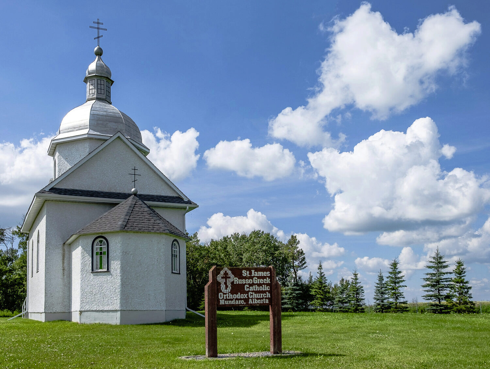
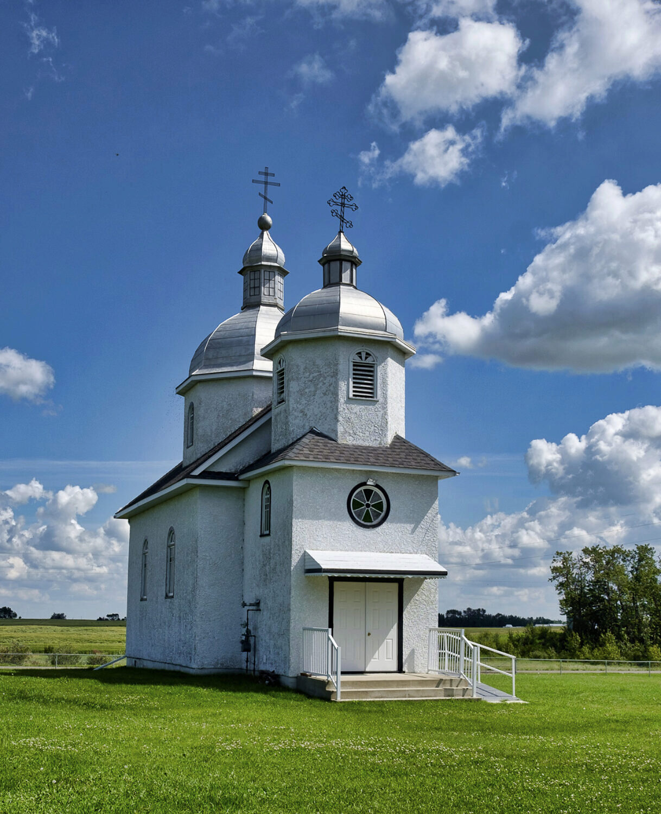

The local residents of Beaver Lake originally constructed St. Jacob’s Church (now known as St. James) in 1901-02. The church was renovated and placed on a concrete foundation in 1942 and is one of the oldest churches in Lamont County. ([Source](http://s3.amazonaws.com/townlife_production/public/uploads/files/0006/2330/churchtourbooklet.05.pdf))

<iframe src="//www.youtube.com/embed/0HgoCNx6qsA" width="90%" height="614" allowfullscreen="allowfullscreen"></iframe>

If this church is one of the oldest in the county, you certainly wouldn’t know that by looking at the church.

The church is quaint, that’s for sure: I’d be tempted to call it a “medium-sized miniature”. But the most striking thing about it is the excellent condition of the structure, just like the nearby “garden”, hall and cemetery. All are obviously very well looked after.

As the “Lamont County’s Self-Guided Church Tours” guidebook points out, “St. James is unusual in that the belfry, which is situated over the narthex \[i.e. the front entrance way\] is an integral part of the church, whereas the majority of the churches built by the Ukrainian pioneers have freestanding bell towers, as was the tradition in the Old Country. ([Source](http://s3.amazonaws.com/townlife_production/public/uploads/files/0006/2330/churchtourbooklet.05.pdf))

### Image Gallery

Click on an image to view a larger version.


### Location

<iframe src="https://www.google.com/maps/embed?pb=!1m18!1m12!1m3!1d2365.792700804152!2d-112.36365538367485!3d53.63283646091355!2m3!1f0!2f0!3f0!3m2!1i1024!2i768!4f13.1!3m3!1m2!1s0x0%3A0x0!2zNTPCsDM3JzU4LjIiTiAxMTLCsDIxJzQxLjMiVw!5e0!3m2!1sen!2sca!4v1502651406152" width="100%" height="550" allowfullscreen="allowfullscreen"></iframe>
