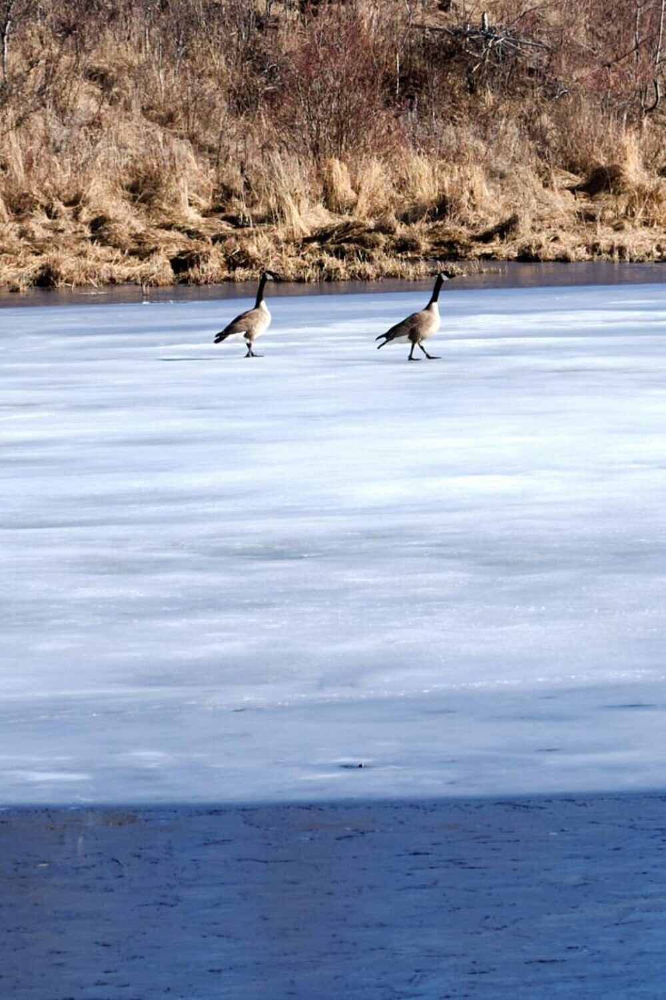
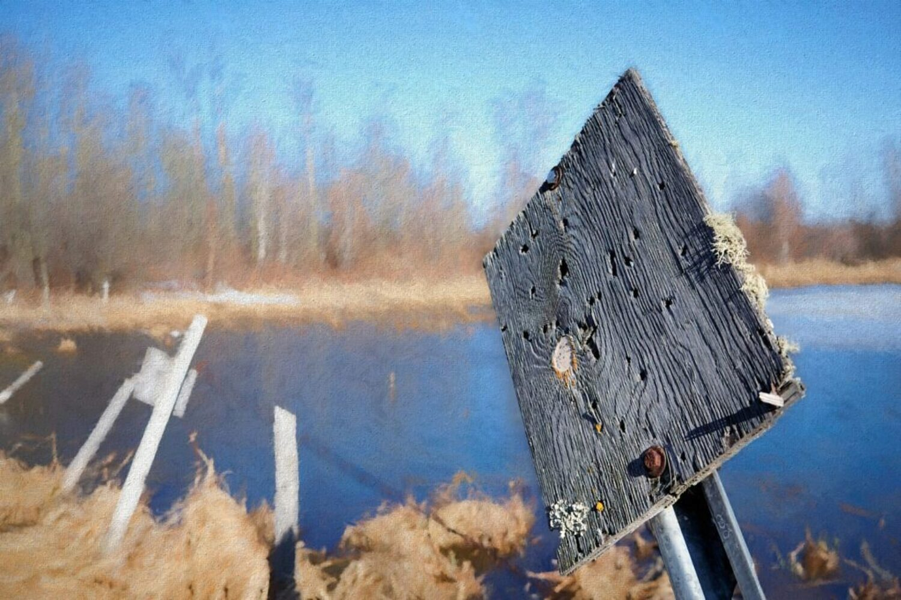
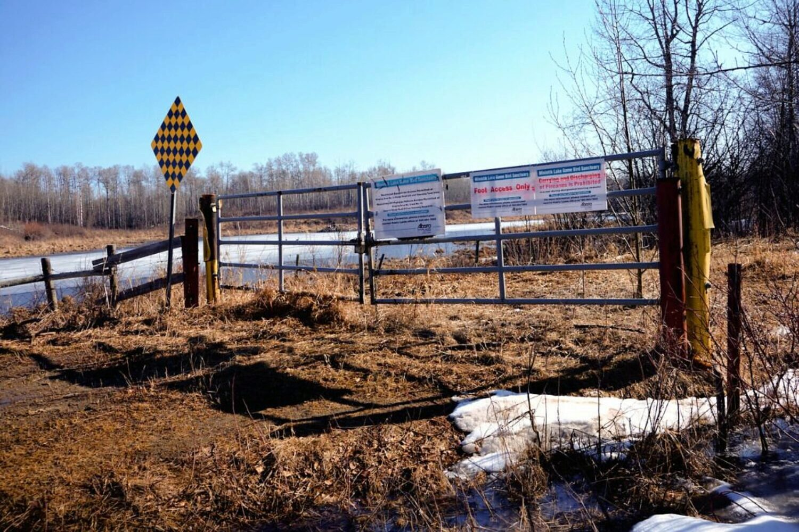
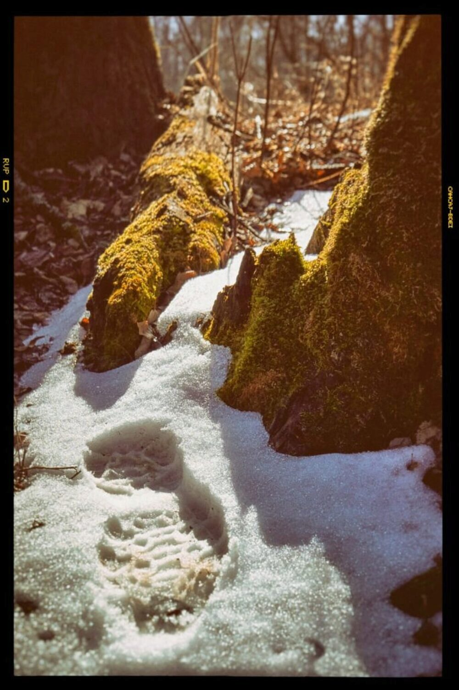
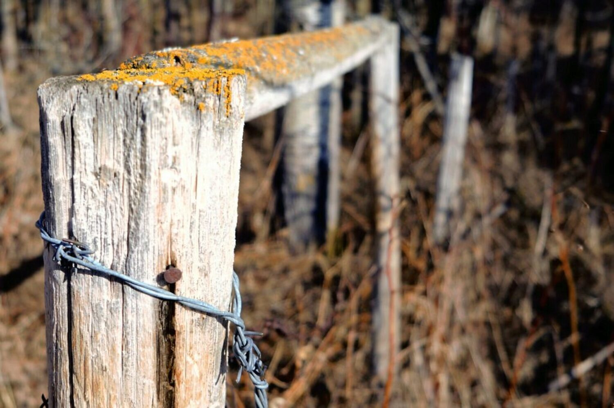
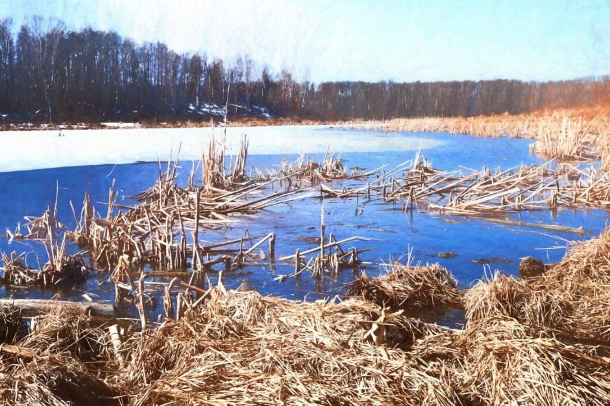
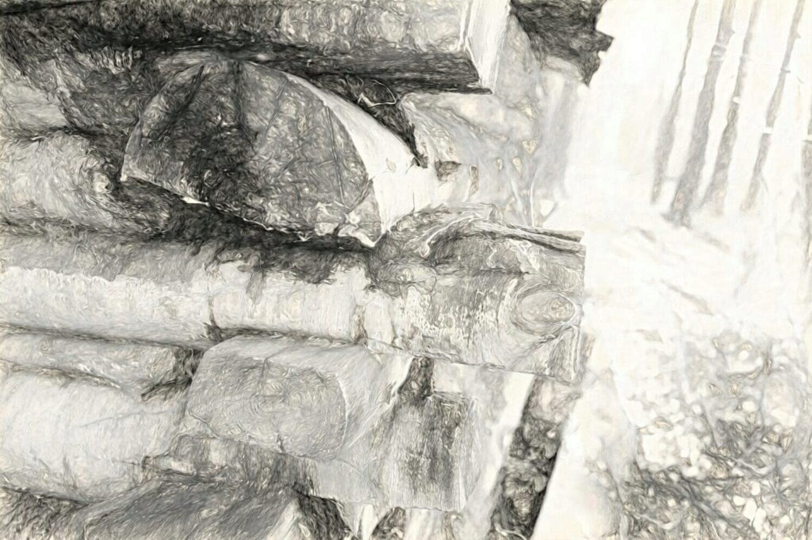
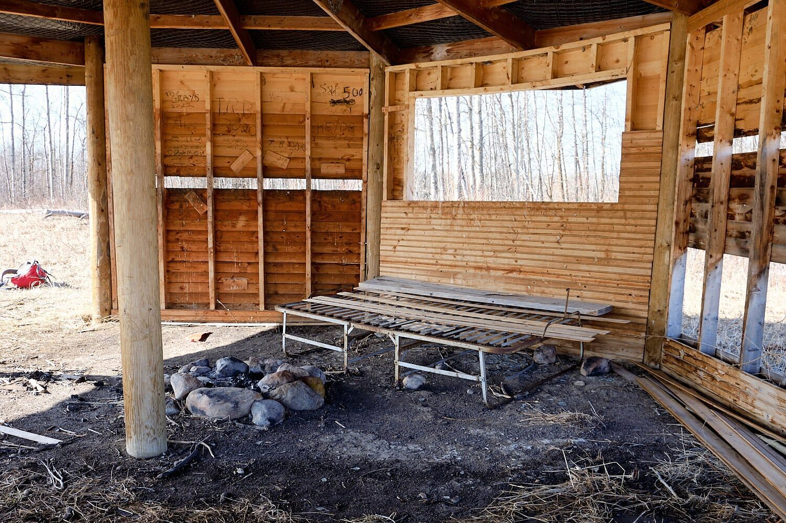
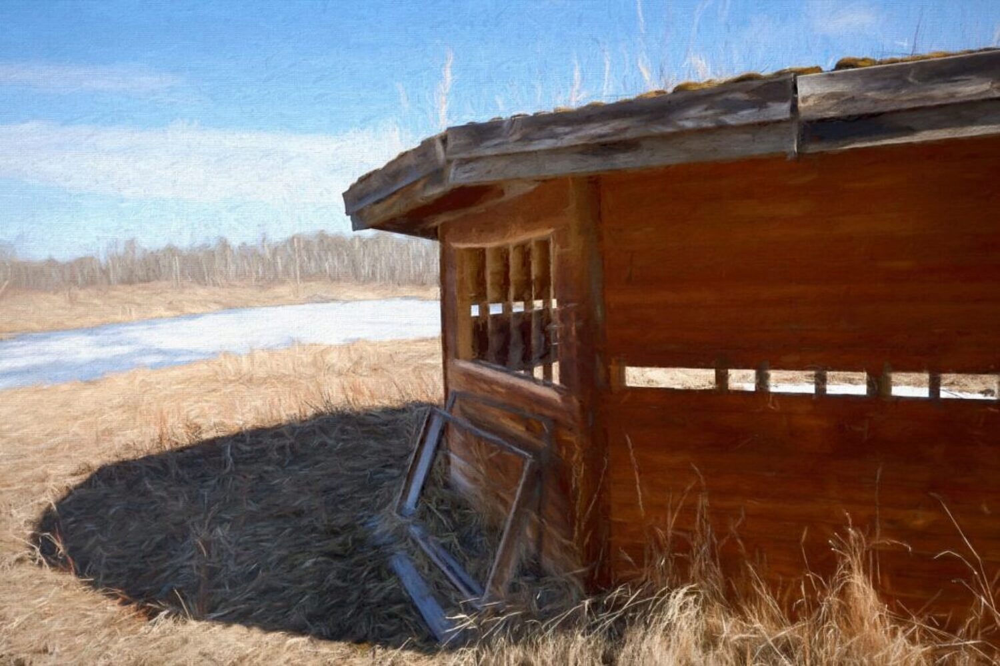

It's nearing the end of April, 2022 here in Alberta, Canada. [The cherry blossom season has already come and is long gone in Japan this year.](https://tokyocheapo.com/entertainment/outdoors/tokyo-cherry-blossom-forecast/)

So I don't think it is too much to ask to expect to capture a _little bit_ of spring "springing", or [nature "naturing"](https://en.wikipedia.org/wiki/Natura_naturans) as I embark on a little photography-minded hike from the parking spot near Mandy Lake in the Ministik Game Bird Sanctuary today.

There's a modestly-sized body of water right next to the parking spot and right away a pair of Canada geese - harbingers of spring - loudly share their opinion about my visit. Judging by the tone, I get the sense they have something against it. At any rate, it's clear they've got a lot to say about it.

Despite that questionable welcome, I decide to linger to tease out a few photos of the pond's shoreline (see the image at the top of the page) and an example of a common feature of the Ministik, a sign that has long since shed its message.

Spring still hasn't arrived as far as parts of the road was concerned: parts of the road are still covered with crusty snow and hard-packed ice. Snowmobiles pack down the snow on the road during the winter so it's the last to melt in the spring.

After an obligatory photo of the gate at parking, I continue down the road toward Mandy Lake. Today, unusually, I actually have a camera with attached lens in hand and I'm hunting for signs of spring.

A scan of the trees along the road doesn't reveal any of the trees budding yet. Despite the humans' calendar proclaiming spring, winter still has its hold on the earth here today so becomes clear to me that obvious signs of spring aren't revealing themselves just yet. I decide instead to simply take photos of what catches my eye along the way.

And when stepping off the road a few meters into the bush, the last remnants of snow that once blanketed the world here records my presence.

An old gate along the road is a rare artifact of past human activity in this area.

The Mandy Lake shoreline is still in dormant as the lake ice recedes.

A dilapidated log cabin along the shoreline is itself slowly returning to the earth.

At the end of the road, beside a small pond the local beavers maintain, a former "officially-built" shelter is also slowly disintegrating. It looks like snowmobilers use the shelter as a handy place to stop and roast a few wieners in the winter.

And finally, the shelter with a painterly look

