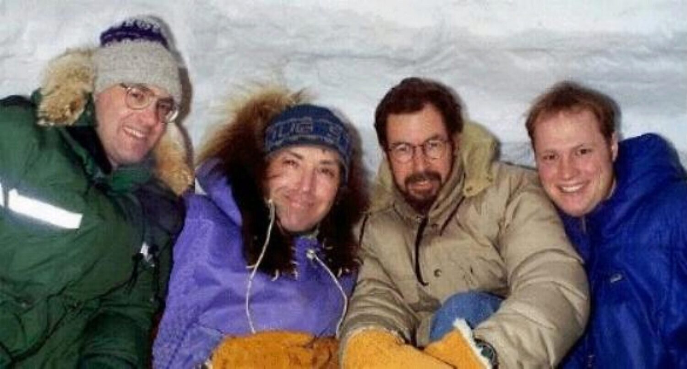
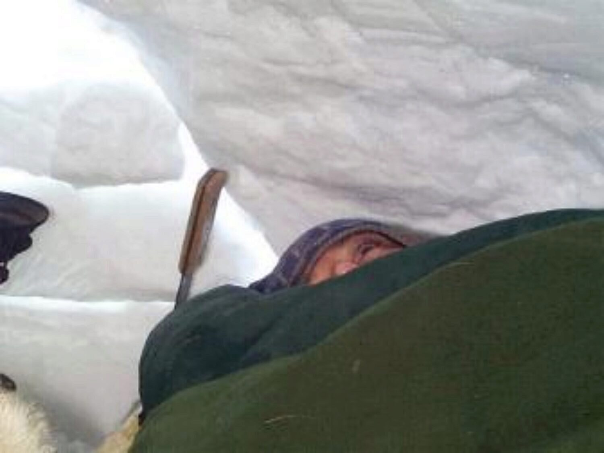

Soon after the group “igloo building bee”, the first brave souls to sleep in the igloo (the first night after we built the thing on March 22, 1998) were Doug S., Suzanne and Alex T. The rest of us had VERY legitimate excuses not to sleep in the igloo all night in -30°C weather. (_Yeah, right)_ Well, they reported the next day that they were warm, and aside from some reports of strange dreams, all was well.

The next shift about a week(?) later was to be Tim S., Keith W. (a visiting CBC "producer for hire" from Vancouver), me and Suz B. At the last minute a sleeping bag Suz thought she had lined up didn't materialize so she dropped out. Doug, our igloo builder, decided to join us for what would be his second night in this igloo.

We started to get ready to "move in" at about ten o'clock. We went to Doug's place where we collected a bunch of caribou hides, a muskox hide and even a grizzly bear hide, all of which would serve as insulation on the floor of the igloo.

Just before we all finally got into the igloo and sealed the door from the inside to keep in the warmth that would be created by a lantern and our body heat, I took the chance to rid myself yet once more of that pesky body fluid so I wouldn't feel the need to get up in the night.

This was no small thing to consider. And you have to understand that when you’re in an igloo for the night, you’re IN. Once everyone’s inside, the door is sealed shut by maneuvering a snow block into place and then packing the cracks with snow. Of course this is necessary to trap the heat inside during the night.

It's funny that the whole time getting ready for this venture, this “no escape” and therefore “no pee" factor was the heaviest weight on my mind.

The igloo was situated on the west edge of town. It was quiet and DARK. There’s very little light pollution even on the edge of a small town in the arctic, so the stars really made an impression on me. Everywhere I've gone in the world, the familiar constellations have been there to remind me that no matter how different it might be on the ground, I’m still living under the same night sky.

The Big Dipper was there that night and the North Star was almost straight overhead. You had to tilt your head back to see pin point it. It’s the arctic, right?

More group shots


We got all the sleeping bags and skins into the igloo by about 11 p.m. and started to settle down to choose places. Doug started the Coleman lantern which was going to be our sole source of heat. All of the sudden, being on the outside wall of the four sleepers wasn't a good thing. I was the tallest of the bunch so pretty much had to be in the middle two sleepers just so I could fit.

We rummaged through the sleeping bags, tried to get comfy and in time had our spots and positions for the night. And my goodness it was tight for this six foot tall guy.

Doug had brought along a good number of bags and a couple including mine were spread across everyone. There was no problem with keeping warm. The sensation was strange on the nose, though, because the air was cold and the steam would billow out the nostrils with every exhalation. 

All in all, the sleep was like a camping sleep to me. (That means it took me LONG time to get to sleep and I only ever slept lightly, it seemed). The cold wasn't a factor at all, but the comfort level was. I finally went to sleep after a long while of staring at the snow dome over me.

It was a great experience sleeping in the igloo I'd helped to build.

The epilogue? Well after waking at about 7:00 a.m. we parted slowly. Doug and I sealed up the igloo again from the outside, because we'd left all the hides and bags inside for the day.

I made the 10 minute walk home and after looking at the clock I realized that I was exactly on schedule with my usual morning routine. I had to laugh out loud. What a strange feeling. You sleep IN the elements over night and the routine of the work-a-day world grabs you again and makes you march. To top it off I then got a phone call from the computer lab at work: "_Grant, what's the password for Computer #4_?"

This age's BEAST never lets go of you Virginia.
