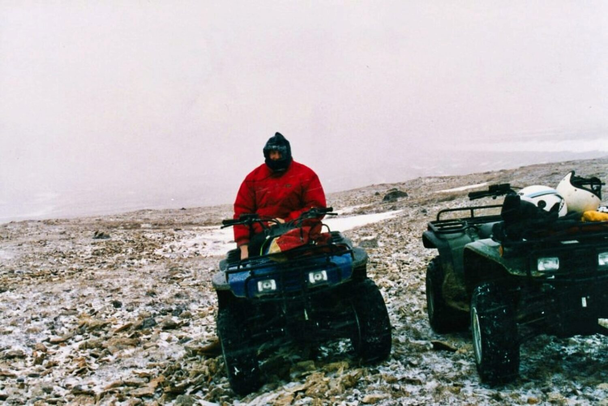
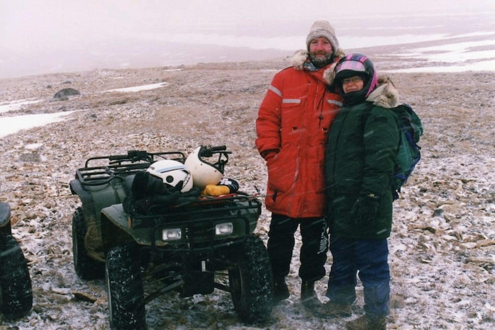

<base target="_blank">

### My 2020 Commentary on this Content Written in 1998

This post is about an afternoon quad ride out of town with a co-worker, Brian S. and his girlfriend Tracey a nurse. Our goal was to get to “Mount” Pelly, a bump on the horizon and the highest point in this region of Victoria Island. 

What made the trip memorable was that it was snowing with a strong wind the whole time we were traveling, making for a challenging, but fun, almost other-worldly experience.

> “Mount” Pelly is an esker and is called “Uvayuq” in inuktitut, the native language of the Inuit.
> 
>  _I know this now because Wikipedia told me so. There was no Wikipedia the day we undertook this trip. It would first appear a little over 2 years later._ Source: [https://en.wikipedia.org/wiki/Uvayuq](https://en.wikipedia.org/wiki/Uvayuq)

**_Saturday, September 27, 1997_**

After [a morning of taking pictures](), I returned to town, a little cool and a bit hungry. I had some lunch and dressed up very well, with heavy-bibbed ski pants, my winter parka, and leather gauntlet mitts. I was VERY glad I did. 

> **Comment in 2020:** these winter clothes were purchased just before coming to Cambridge Bay. I still have them all, except the large mitts which have vanished to somewhere. Even though I live in Edmonton, Alberta now, known for having its share of cold winters, these clothes are generally too just much for an Edmonton winter. I’ve only worn the whole get-up together once in the last 22 years and that was for a -40 C crazy _mid-winter_ hike a few years ago.

I met Brain and Tracey at Tim's where they were borrowing an ATV. Just as we headed out, it started to snow. As we made our way to Mount Pelly, the snow blew straight into our faces. I swore at myself for not wearing my glasses at least. I could have chosen a helmet with a visor. NO. Apparently I chose pain.

About 10 or 15 minutes out of town we saw four large swans in a pond. It is quite unusual for swans to be hanging around these parts at this time of the year. Just as we stopped, the four of them spooked and started to take off. That was a beautiful sight. The wings had power, while the landing gear flippered feet seemed to walk them along the water.

We made our way to Mount Pelly on the windy road. It was fun trying to avoid the puddles across the road. Because my lack of appropriate face covering, I was squinting hard the whole way. It was a constant struggle to adjust my balaclava so that the least amount of snow would fly into my eyes. It was one those times when driving slowly would have meant less pain but a longer ride. Driving faster would make for a shorter trip, but more pain. What to do?!

I was on the quad alone, so as we left the road, going across the raw rocky tundra was fun for me. The furrowed cut lines created by yearly run off were fun to buck over. You had to have your wits about you to avoid sharp rocks, bad lines of attack, all the while trying to get to where you thought you wanted to go.

We stopped the quads pretty much at the foot of the "mountain." Anywhere else, Mount Pelly would be thought of as large-ish hill, but because this is flat, arctic tundra, this is called a “mountain”. It’s all relative.

We trudged up the slope into the now heavy blowing snow. It was surreally **real**. We found a big rock to lean on and Tracey broke out the hot chocolate and Bailey's. NUM NUM. Then we pretty much just sat.

And those moments of sitting in the blowing snow will make up the mental snapshot of the trip that will remain with me the longest.

I thought about people living in this harsh environment. It wasn't terribly cold, but if a person's stomach was empty, there wasn't much chance of hunting much in this kind of weather. We talked about it. My initial conception is that it is such an inhospitable land. Given the choice, I really wonder why people didn't migrate south and even fight for the opportunity to migrate if need be. Why here? I hope to get this question partially answered.

I really felt content just lying down on the wind packed snow. The atmosphere was filled with blowing snow, visibility had worsened during the 15 minutes of our rest stop. The wind blew by, through, and around you. On the ground small lichen covered rocks were resigned to being covered in snow for another season. Blades of grass were covered in sheathes of ice many times their thickness. Was this a protective ice covering, or a clear coffin for them?

We decided to make our way back since the visibility was deteriorating so quickly. The lay of the land on the way back was all downhill and the telling of the story will reflect that. We motored very quickly back to town, this time with the wind at our backs. Again it was fun making the twisty turns on the quad. This time the puddles were less of a factor because may were simply covered with snow. Driving through them didn't make a splash, just a slushy tire track.

In all likelihood, that will be the last trek out onto the land this season. The snow seems to be staying. The cold weather is creeping in. Let it. After returning the quad, and going back home, I wrapped up the day with a steaming hot bath with a hot cup of coffee. "AHHHHHH," I said, as I turned lobster red.
