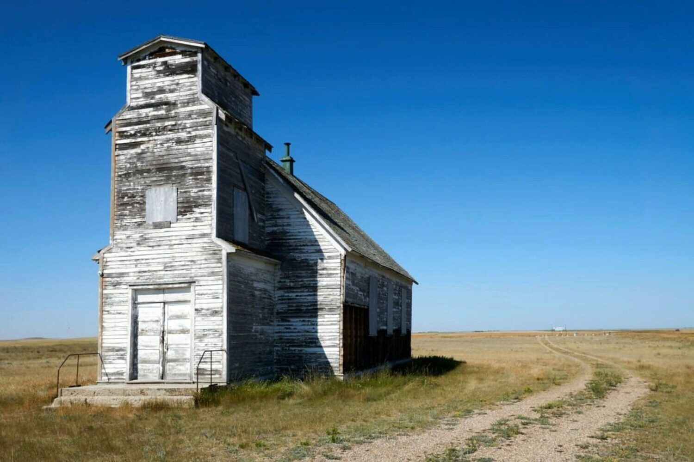

St. Anthony of Padua Church and Cemetery are located southwest of Medicine Hat. The church has fallen into disrepair and seems to stand as a symbol of a past reality now fading.

A story entitled "[Tattered rural church tells an historic story](https://medicinehatnews.com/news/local-news/2020/07/24/tattered-rural-church-tells-an-historic-story/)" written by Gillian Slade and published in the Medicine Hat News on July 24, 2020 is the sole source of information I could find about the church and nearby cemetery.

The article says the 10-acre site was acquired in 1911 with local families each contributing $50 in order to make the purchase. Parishioners built the church between 1912 and 1916 when it was officially opened and named St. Anthony of Padua.

Attendance waxed and waned over the years and when funds were raised, the building was augmented in a major way in 1951 and also later through the 1970's. The final formal event at the church was a wedding in 1986.

It's saddening to hear the only noteworthy events since then were major attacks of vandalism and theft from the building in 1991 and later in 2014.

The cemetery located behind the church has a sparse number of graves.

## Gallery

