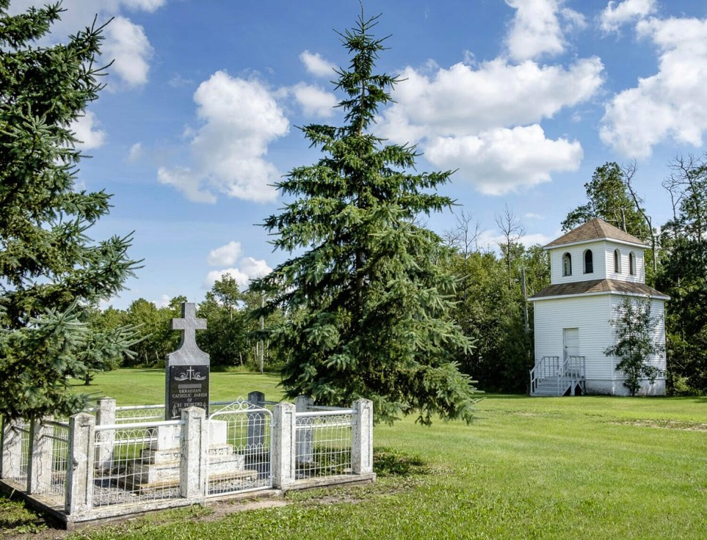

<iframe src="//www.youtube.com/embed/-oMu6RaY3t4" width="90%" height="614" allowfullscreen="allowfullscreen"></iframe>

The St. Demetro Ukrainian Catholic Church you see today is the third iteration of the church. In the past, it was nicknamed “The Farm” or alternately “Seniuk” in honour of nearby early homesteaders Peter and Apolonia Seniuk. ([Source](http://www.eeparchy.com/about-us-2/about-us/history-of-the-edmonton-eparchy/hilliard-farm-st-demetro-parish/))

The original church at this site, a small two-room structure, was built in 1903 for $380: $300 for the materials and $80 for the carpenter. In 1926, a larger church as built with a belfry being built in 1935 and situated at the site of the original chapel.

This new 1926 church was a beautiful building as you can see in this thumbnail from the [Ukrainian Catholic Eparchy of Edmonton site](http://www.eeparchy.com/contact-us/parishes/vegreville-deanery/785-2-2-3/). It lasted a good, long time, but unfortunately it burned down in 2007. The monument commemorating the second church displays the dates 1922 - 2007, perhaps including the years when the parish raised funds for the materials.

")

There’s a brand new church here now, the one you see here from my August, 2017 visit.

### Photo Gallery


### Location

<iframe src="https://www.google.com/maps/embed?pb=!1m18!1m12!1m3!1d2364.375695594843!2d-112.43557198423376!3d53.65810315901467!2m3!1f0!2f0!3f0!3m2!1i1024!2i768!4f13.1!3m3!1m2!1s0x0%3A0x0!2zNTPCsDM5JzI5LjIiTiAxMTLCsDI2JzAwLjIiVw!5e0!3m2!1sen!2sca!4v1503025027447" width="100%" height="550" allowfullscreen="allowfullscreen"></iframe>
