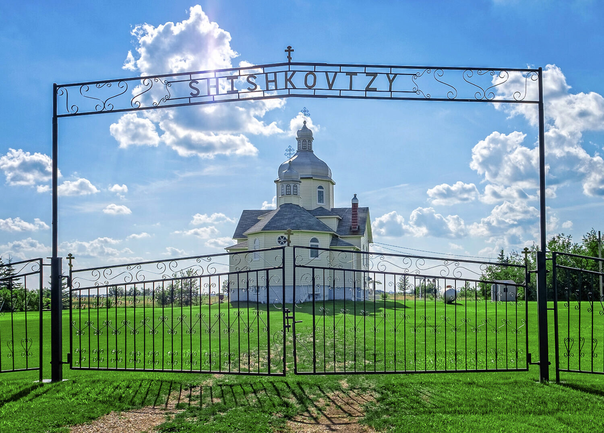
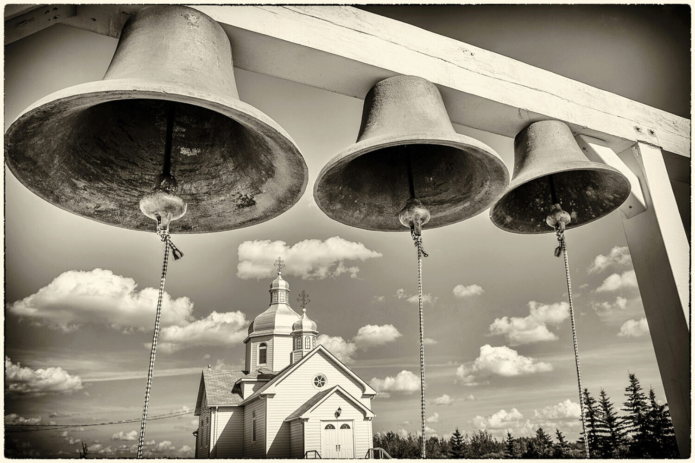

St. Mary’s Holy Dormition Russo-Greek Orthodox Catholic Church (Shishkovitzy) is located on Range Road 182, near Township Road 540,  13 km west and 2 km north of Mundare, AB.

“Shishkovitzy” is front and center on the tasteful gate of the church entrance and is “derived from the village of Shyshkivtsi, Bukowina, in Western Ukraine, where some of the founders of this church emigrated from at the end of the 19th century” ([source](http://s3.amazonaws.com/townlife_production/public/uploads/files/0006/2330/churchtourbooklet.05.pdf)).

<iframe src="//www.youtube.com/embed/bMtZ7o5ePpk" width="90%" height="614" allowfullscreen="allowfullscreen"></iframe>

Most local settlers arrived in the area around 1898, started building a church in 1903 and finished the next year. A monument just north of the present building marks the location of the original church. Parishioners gathered funding for a new church for a decade beginning in the early 1950’s and the present church was built in 1963. In 1965 The original church was relocated to the Shandro Historical Museum and Village on Secondary Highway 857, north of Willingdon.

[Please take the time to check out this page](https://orthodoxcanada.ca/Shishkovtsy-Shandro_AB_Museum_Dormition_of_the_Theotokos_Museum_Orthodox_Church_1903-1963) which provides even more information about the construction of the original church, complete with pictures of the interior.

The church is in excellent condition, nicely painted and strikes me as “compact” and “proper”. The photographer in me wasn’t all that happy with the large natural gas tank situated above ground right beside the church, but of course practically demands that it be there.

Instead of a belfry, three church bells are fastened to a post just west of the church. The bells were donated by one of the early pioneer families.

### Photo Gallery

Click on an image to view. Then click on the left or right arrows to navigate through the gallery.



### Location

<iframe src="https://www.google.com/maps/embed?pb=!1m18!1m12!1m3!1d2366.480647865181!2d-112.56010538401122!3d53.62056668003739!2m3!1f0!2f0!3f0!3m2!1i1024!2i768!4f13.1!3m3!1m2!1s0x0%3A0x0!2zNTPCsDM3JzE0LjAiTiAxMTLCsDMzJzI4LjUiVw!5e0!3m2!1sen!2sca!4v1502643720842" width="100%" height="550" allowfullscreen="allowfullscreen"></iframe>
