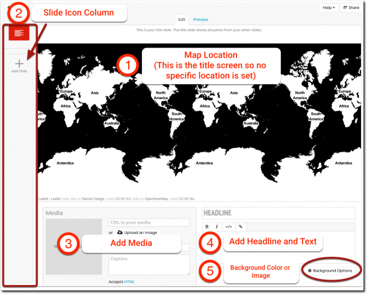
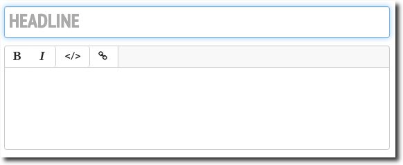
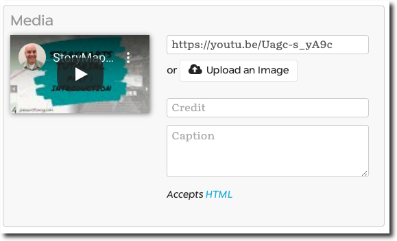
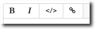
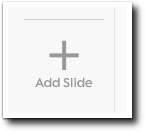
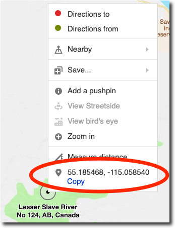
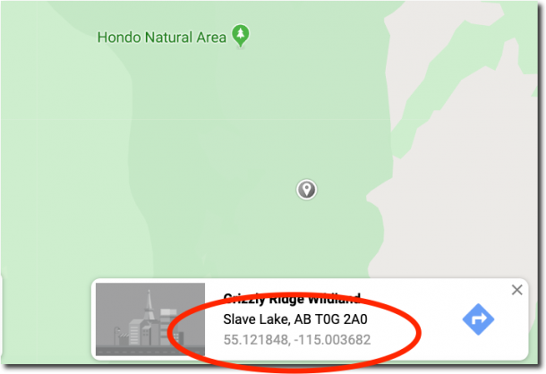
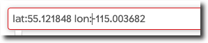
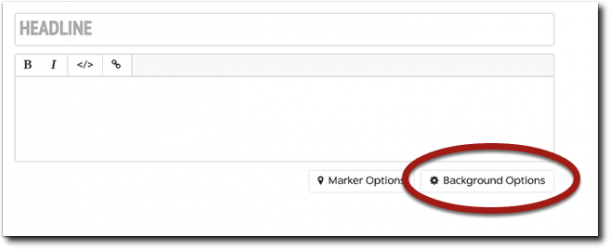
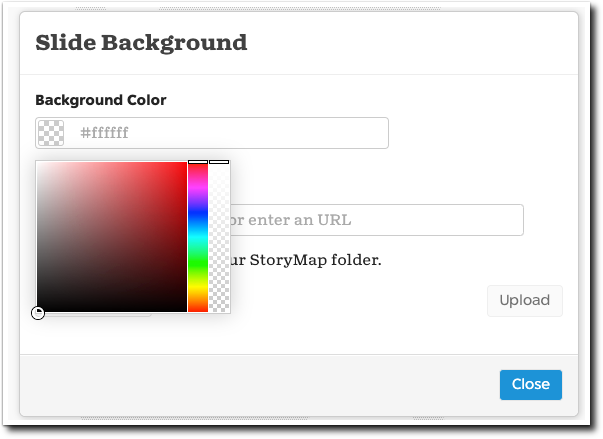

<base target="_blank">


StoryMapJS is free online software that lets you tell a story with media — including images, video or audio - and augment that story by displaying specific locations on a map. It’s one of many projects developed, hosted and freely shared by Knight Lab, part of Northwestern University. [Check it out here at the Knight Lab site.](https://storymap.knightlab.com/)

**This is Part 2 of a three-part tutorial on StoryMapJS**. [In Part 1, I introduced StoryMapJS](), reviewed a couple of StoryMap examples and briefly covered the authoring tool. Here we’ll focus on how to build a StoryMap and in Part 3 I’ll cover how to share a StoryMap. First you’ll need to log in to StoryMapJS and that is covered in Part 1: [click here to review]().

### The StoryMapJS Authoring Tool

After logging in, the first screen you see is the StoryMapJS authoring tool ready for you to add content to the StoryMap’s title slide. Here’s a brief overview of the sections of screen.

1. **Map Location** This is where you set the location on the map. In your completed StoryMap, the title slide displays all the locations of the slides in your StoryMap. So you don’t specify a location on this particular slide.
2. **Slide Icon Column** The left hand column displays the icons for the title slide, shown in red here, and the slides you add to your StoryMap. This let’s you select a certain slide to edit as you’re building your StoryMap.
3. **Add Media** You can upload images or provide links to images, video streaming services (YouTube, Vimeo and Dailymotion are supported), and many other services such as Wikipedia, SoundCloud and DocumentCloud. The media you add here displays on the right side of the screen above any headline or text you add.
4. **Add Headline or Text** You’ll want to add a headline (or think of it as a title for the screen) and some descriptive text to your slide. The editor has bold, italic and hyperlink buttons. It also includes an “Edit Code” button so you can view the content with any HTML tags.
5. **Background Color or Image** You can add a background color or image to the right side of the slides. In my experience, adding a background color makes any text you’ve added more difficult to read. My recommendation is to either avoid adding a solid color or add background image instead. When you add a background image, the opacity is automatically changed so that text is easy to read.

### Adding Media to Your Title Slide

To add media to your slides — in most cases, images being the one exception — you add links to media that already exists somewhere else on the web.

Retrieve the URL ( that is, the link to that media) and paste it in the “URL to your media” field at the top of the Media section.

### Add Headline and Text

For example, the URL of the tutorial video hosted on YouTube that accompanies this post is `"https://youtu.be/Uagc-s\_yA9c"`.

To add that video to the slide you would simply copy and paste that URL into the field. It will take StoryMapJS a couple of seconds to connect and then you’ll see a thumbnail of the video appear. Vimeo and Dailymotion videos are supported in the same way.

### Add Media with Thumbnail

Follow this same process to add many other kinds of media to your your slide.

<table><tbody><tr><td>Images</td><td>Paste in the link to image. Note that the default share link from Flickr doesn’t work. You need to extract the images address from the the Flickr embed code instead. Look for the link beginning with “live.staticflickr.com”.</td></tr><tr><td>Wikipedia Pages</td><td>Paste the page address.</td></tr><tr><td>Tweets from Twitter</td><td>Paste the share link from the tweet.</td></tr><tr><td>Audio hosted at SoundCloud</td><td>Paste the share link from the audio.</td></tr><tr><td>Services like Dropbox or Google Photos don't work</td><td>In my experience pasting links to images hosted on a service like Dropbox or Google Photos <strong>will not work</strong>. If there are methods to makes these services work, I’d be happy to learn about them, so please comment below.</td></tr></tbody></table>

### Uploading Images

As mentioned, adding images are an exception to the adding of links to media because you have the option of uploading images directly to the StoryMapJS site. This may be your only option if you don’t have an option to store your images elsewhere on the web.

The process of uploading images is simple:

1. Click the “Upload an Image” button,
2. Search for the image on your computer,
3. Click Open and
4. The image will be uploaded and resized on the StoryMapJS site.
5. Finally, remember to give credit where credit is due. Provide an attribution to the owner of the image if the image is not yours.

### Adding a Headline and Text to Your Title Slide

This section allows you add a “Headline” (or title if you want to think of it that way) and text to your slide.

In the text editor you see four buttons.

1. The **bold and italic** buttons are straightforward enough.
2. Click the “**Edit HTML**” button to change the editor to “HTML mode” where you can see any HTML tags in the content. A blue glow appears around the field when it’s in “Edit HTML” mode.
3. Finally, the **link button** allows you to add web links to content in the editor. Select some text, then clink the link button, supply the URL in the pop-up dialog box, check the “Open link in new window” box and click “Insert Link”.

### Adding a Location to a Slide

You add new slide by clicking the **Add Slide Button** in the left column.

The only change you’ll see from the title slide is you now have a search field to find locations on the map. You can search for a location like a city or an address. Once you have located the place you’re looking for, you can zoom in on the map using the “+” button in the upper left and then click, hold and drag the map marker to wherever you want on the map. Since I tend to travel to places that don’t have addresses, I often use GPS coordinates instead.

### Entering GPS Coordinates on the Map

To create a map marker using GPS coordinates, first you’ll need the coordinates in Decimal Degrees format, meaning the degrees and minutes need to look like this: DDD.MMMMM.

You can easily get GPS coordinates from online mapping services like Google Maps or Bing Maps. For example, on Bing Maps, simply right click the location on the map and copy the coordinates at the bottom of the context menu.

In Google Maps, it’s a tiny bit more manual: left click a location on the map. A information dialog box should appear at the bottom of the screen. Select the GPS coordinates and copy them.

### Finding Coordinates with the StoryMapJS Search Field

Here’s the process for making StoryMap recognize your GPS coordinates:

Paste the GPS coordinates in the “Search for a location” field at the bottom of the StoryMap map section. Remove any punctuation between the two numbers. Add “**lat:**” (without the quotation marks) in front of the latitude and “**lon:**” in front of the longitude, like this:

When you’ve done that, the map should recognize the coordinates and automatically create a marker at those coordinates. You can then reposition the marker manually by clicking and dragging it with your mouse.

### Adding a Background Image (or Color) to a Slide

You can add a background color or a background image to the right side of the screen.

To see the “Slide Background” dialog box, click the “Background Options” button at the lower right.

### Add a Background Color

To add a background color, click inside of the “Background Color” field and a color picker appears. The field only accepts color hex values but the color picker lets you find the hex value if you drag the picker and use the coloured column at the right to chose the color you want.

In my experience, adding a background color tends to make any text you have on the screen less readable. I suggest to you check this out yourself.

### Add a Background Image

You can add a background image by pasting the URL of an image hosted on the web into the “Background Image” field or by uploading an image. Other images you have uploaded to this StoryMap are available by clicking the down arrow at the left.

The opacity of background images is automatically altered so that text is easy to read, even with a somewhat busy image in the background.

What to learn more? In Part 3 of the tutorial I’ll cover:

1. Adding your Your Map Markers
2. Configuring How Your StoryMap is Displayed
3. Sharing Your StoryMap
