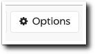
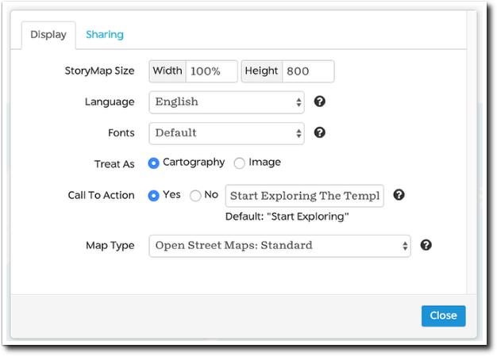
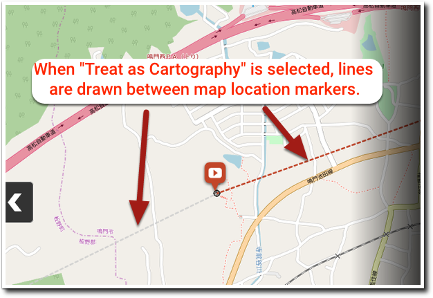
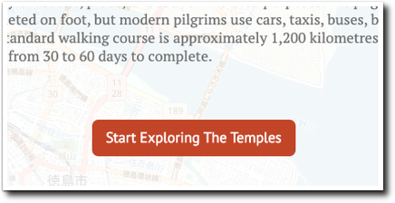
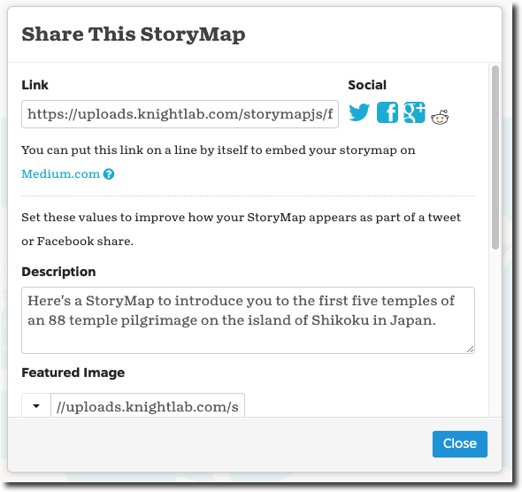
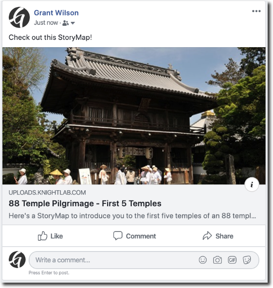
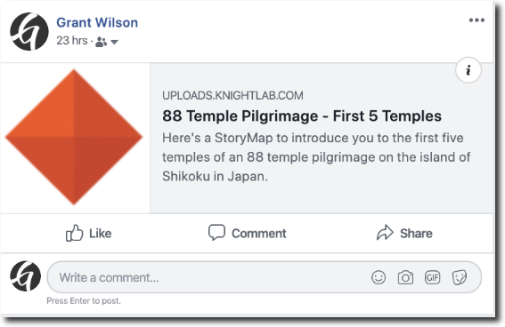
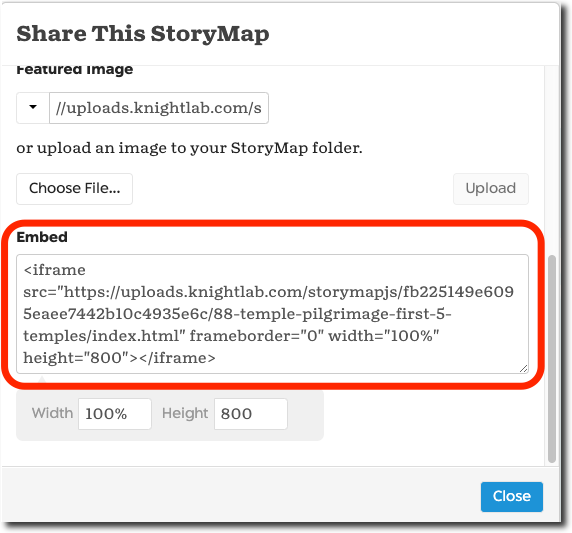

<base target="_blank">



### Welcome to Part 3 of the StoryMapJS Tutorial

StoryMapJS is free online software that lets you tell a story with media — including images, video or audio - and augment that story by displaying specific locations on a map. It’s one of many projects developed, hosted and freely shared by Knight Lab, part of Northwestern University.


[In Part 1, I introduced StoryMapJS]().

[In Part 2, I covered the process of building StoryMap slides.]()


 In this third and final part of the StoryMapJS tutorial, I’ll cover

1. Understanding the Publish Changes Button
2. Adding your Your Map Markers
3. Configuring How Your StoryMap is Displayed
4. Sharing Your StoryMap

### Understanding the Publish Changes Button

StoryMapJS saves your work to two separate versions of your StoryMap: the Draft version (named “draft.html” if you link to it) and the “Final” version (named “index.html”). In Part 1 of the tutorial we covered the “Save” button. This saves your most recent changes to the Draft version. Those changes are saved to the “Final” version only when you click the “Publish Changes” button. This way you can work on making changes to the StoryMap in the background and not publish those changes until you’re sure you want to.

### Adding Your Own Map Markers

By default, the markers on the map reflect the kind of media you’ve added: an image will have a certain icon, a YouTube video another.

The “Marker Options” button lets you add your own marker images to the map which will display instead of the default markers you see.

Since my StoryMap is about Buddhist temples, it might be a nice touch to add map marker icons that remind one of a temple.

I can upload this icon to the StoryMapJS site and it will display instead of the default markers.

Each slide icon is independent of other slides so you could upload icons that represent the location such as a store, or airport or museum, etc.

### Options Dialog Box

The Options dialog box contains a number of important settings that affect how your StoryMap is displayed. Open the dialog box by clicking the Options button at the top left.

### StoryMap Size

These numbers determine the size of an embedded StoryMap. My recommendation is always keep the width at 100%. You may need to alter the Height once your StoryMap is embedded on your webpage, depending on the space available on the page and the amount of content on your slides.

### Language

This setting changes the navigation buttons and messages in your StoryMap to the the selected language.

### Fonts

StoryMapJS offers a number of font combinations for your headline and text. Take the time to try a few of the combinations because they can enhance the aesthetic of your StoryMap substantially.

### Treat as Cartography or Image

The primary difference between these too settings is the that lines are drawn between map location markers when “Treat as Cartography” is selected. Those lines do not appear when “Treat as Image” is selected.

### Call to Action

If you choose “Yes”, a button appears on the title screen of your StoryMap under the headline and text you’ve added. The button is meant to prompt the visitor to continue to the next slide.

The default text of the button reads “Start Exploring”, but you can change that in the text field here. As an example, I’ve changed the text to “Start Exploring The Temples.”

### Map Type

StoryMapJS allows you to change the basemap that displays on the left side of the screen. You may want to change the baseman depending on the aesthetic you want your map to present.

<table><tbody><tr><td width="15%"><strong>Built-in map types</strong></td><td><strong>Stamen maps</strong> are generally present a low detail, subdued look. <strong>Open Street Maps</strong> offer an accurate, highly-detailed map.</td></tr><tr><td><strong>Mapbox</strong></td><td>Mapbox is a mapping service that is completely separate from StoryMapJS. Mapbox offers both free and paid accounts and with the free account, your maps are allowed a generous allotment of up to 25,000 views / month. Mapbox has a number of built-in styles including “Streets”, “Light”, “Dark”, “Outdoors”, and “Satellite”. <a href="https://docs.mapbox.com/mapbox-gl-js/example/setstyle/" target="_blank" rel="noreferrer noopener">Check out various styles on the sample map here</a>. You’ll need to do a little research on how to best use Mapbox, including creating an account to obtain an “Access Token” in order to access your maps.</td></tr><tr><td><strong>Gigapixel maps</strong></td><td>Gigapixel maps allow you to use a large image as your map instead of the usual map of the earth. For example, the “<a href="https://storymap.knightlab.com/examples/aryas-journey/" target="_blank" rel="noreferrer noopener">Game of Thrones: Arya’s Journey</a>” map example on the site uses an image of Westeros from the Game of Thrones as the basemap. You’ll need special software to break any large image into map tiles, allowing your visitor it zoom in certain parts of the map. To learn more about the software and the concept, <a href="https://storymap.knightlab.com/gigapixel/" target="_blank" rel="noreferrer noopener">check out this page o the StoryMapJS site to learn more about gigapixel maps</a>.</td></tr><tr><td><strong>Custom maps</strong></td><td>&nbsp; If you are using custom maps, the assumption is you are hosting your map and all the tiles that make up the zoom levels of your map, on your own web server.</td></tr></tbody></table>

### Sharing Your StoryMap

The share button lets you share your StoryMap with others. Let’s go through the options it offers you.

### Share Link

The share link is a simple URL which, when accessed, will open your StoryMap in a web browser window.

Note that if you paste a link into a post on Medium.com, the service will automatically render the link into an embedded version of the StoryMap (more on embedding below).

### Social Media Shares

StoryMapJS also provides links to a few social media services like Twitter, Facebook, and reddit.

You can add a brief description and provide a “Featured Image” to enhance your post on Facebook or Twitter.

For example, if you provide a featured image, your post would look like this on Facebook.

If you don’t supply a featured image, an image of the Knight lab logo is attached instead.

### Embedding Your StoryMap on a Webpage or Blog Post

Embedding your StoryMap on a webpage or blog post displays it on the page itself by using the HTML “iframe” tag. The advantage of embedding your StoryMap on your web page or blog post is your visitors don’t leave your site in order to experience the cool content you’ve created.

For example, here are the steps to embed your StoryMap in a WordPress post.

1. Copy the embed code from the Share dialog box.
2. Assuming you’re using WordPress’s newer Gutenberg editor, you’ll want to use the “Custom HTML” block. Paste the embed code into the “Custom HTML” block, save the post as a draft (or publish it) and view the post.

Note: If you’re using WordPress’s “Classic” editor, you’ll need to paste the code into the “Text” tab which displays your post along with any HTML markup that has been applied to it.

That wraps it up for Part 3 of the StoryMapJS tutorial and for the entire series.


If you missed them, check out [Part 1 where I introduce StoryMapJS]() and [Part 2 where I go through the process of how to build StoryMap slides]().

