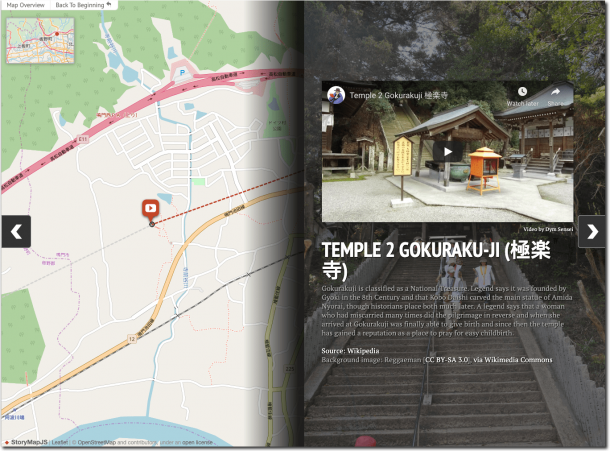
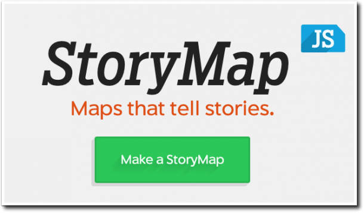
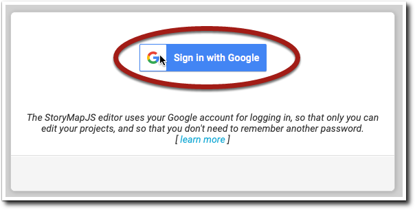
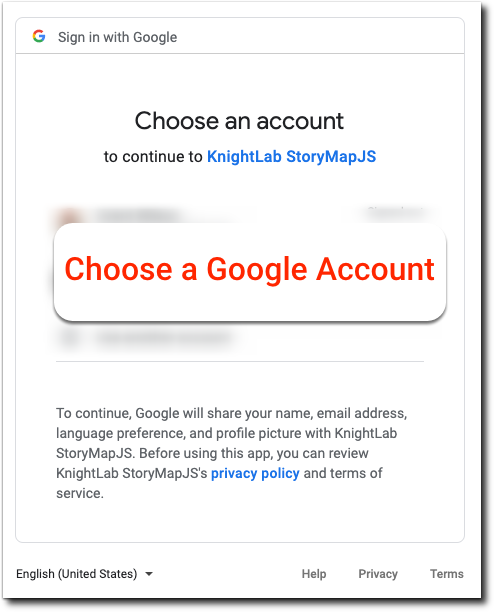
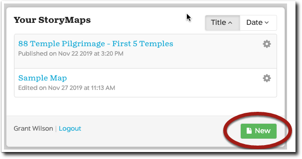
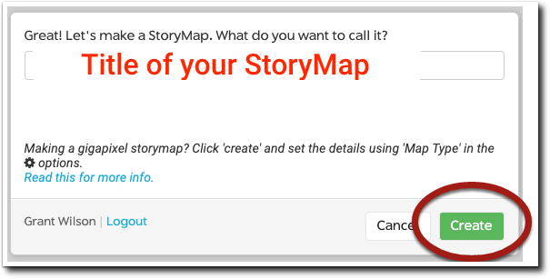

<base target="_blank">


When you’re telling others about where you’ve gone and what you’ve experienced, wouldn’t it be cool to show them the exact locations of your travels on a map while you’re telling your story?

StoryMapJS is great way for you to do just that.

This will be part one of a three part series about StoryMapJS. Here in Part 1 I’ll introduce you to StoryMapJS. Part 2 will cover building a StoryMap and Part 3 will cover sharing or publishing the finished result.

### What is StoryMapJS?

StoryMapJS is **free** online software that lets you tell a story with media — including images, video or audio - and augment that story by displaying specific locations on a map. It’s one of many projects developed, hosted and freely shared by Knight Lab, part of Northwestern University.

A screengrab of one of the example StoryMaps on the site shows what a “slide” might look like.

A slide is made up of four elements:

1. A **map location** on the left side of the slide. A location is **required** for each slide.

Then at least one of the next three elements is required, but you can include any combination of the three on the right side to the screen.

1. **Some kind of media** such as an image, a video or even audio.
2. A **headline and some textual content** which can include HTML and
3. A **background color or image** to provide a nice aesthetic feel to the slide.

So slides always require a map location on the left, and on the right side need to have at least one kind of media, but can have any variation of the other three elements.

### Creating a New StoryMap

#### Logging in to the StoryMapJS Authoring Tool

StoryMapJS uses your Google Account for authentication so naturally you’ll need a Google account to make use of the service. Make sure you’re logged in to a Google service (Gmail for example) and then browse to

[https://storymap.knightlab.com/](https://storymap.knightlab.com/)

Click on the big green Make a StoryMap button. You can’t miss it! :-)

Sign in with your Google account by clicking the button

Choose an account to sign in with.

The “Your StoryMaps” dialog will appear. To create a new one, click the “New” button.

Give your StoryMap a title (you can change it later if you want) and then click “Create”.

The StoryMapJS authoring Tool will appear ready for you to add content to the StoryMap’s title slide.

### A Quick Tour of the StoryMapJS Authoring Tool

When you create a new StoryMap, the title slide is the first screen you see in the authoring tool. Let’s go through the sections of the authoring tool. We cover the process of how to build a slide in Part 2 of the tutorial.

#### **The parts of the authoring tool.**

##### **1\. Map Location**

This is where you set the location on the map. In your completed StoryMap, the title slide displays all the locations of the slides in your StoryMap. So you don’t specify a location on this particular slide.

##### **2\. Slide Icon Column**

The left hand column displays the icons for the title slide, shown in red here, and the slides you add to your StoryMap. This let’s you select a certain slide to edit as you’re building your StoryMap.

##### 3\. Add Media

You can upload images or provide links to images, video streaming services (YouTube, Vimeo and Dailymotion are supported), and many other services such as Wikipedia, SoundCloud and DocumentCloud.

This media displays on the right side of the screen above any headline or text you add.

##### 4\. Add Headline or Text

You’ll want to add a headline (or think of it as a title for the screen) and some descriptive text to your slide. The editor has bold, italic and hyperlink buttons. It also includes an “Edit Code” button so you can view the content with any HTML tags.

##### 5\. Background Color or Text

You can add a background color or image to the right side of the slides. In my experience, adding a background color makes any text you’ve added more difficult to read. My recommendation is to either avoid adding a solid color or add background image instead. When you add a background image, the opacity is automatically changed so that text is easy to read.

This was just a quick introductory overview of StoryMapJS and its the authoring tool. I hope it gives you a general idea of what the software can do. If you’re the kind of person who likes to learn by hunting and pecking through a piece of software, this might be all you need. Dive in and start using StoryMapJS for yourself!


[Continue to Part 2 where I go through the process of how to build StoryMap slides]().
