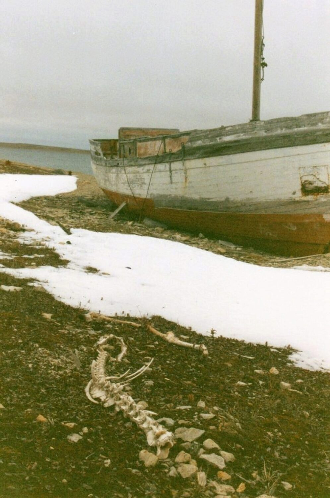
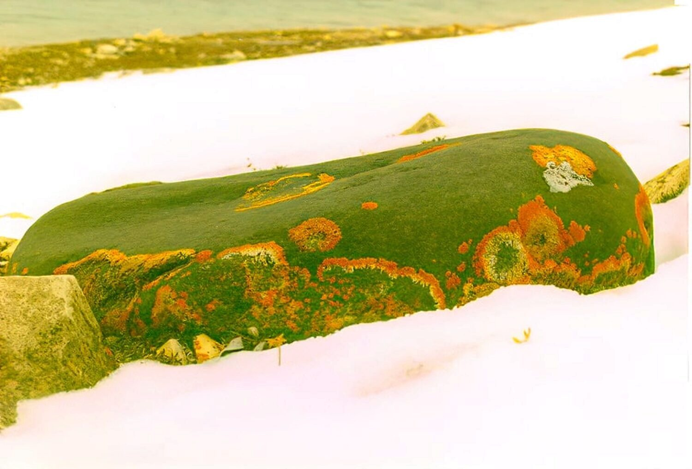

### My 2020 Commentary

This little piece is about a jaunt out of town just across a small bay to the east where the rotting hulk of a boat sits on the shoreline. The story starts out about the prospect of being able to leave town, but then, when I start hunting for photographic subjects, it becomes about leaving my normal way of seeing and thinking to get into the “photographer” zone of seeing the world.

It’s Saturday, September 27, 1997 and the weather was still holding. Most people have been saying that the icing up of the water in the bay is unusually late this year. So the available time for being able to roam out of town on a quad was fast decreasing.

This Saturday morning was chilly. No question. As I walked over to Vicki B.’s house to borrow her ATV (hereafter known a the “quad”), I puffed out some breath. I could almost blow "breath rings." It was an overcast day and there was a chill in the air.

But the weather was still holding. There wasn't four feet of snow on the ground. It wasn't -25 °C. There was still another chance for what could be the last outing, the last escape from town for the next few months.

I picked up the quad and helmet, pumped up one of tires with a bike pump - it has a slow leak - and got ready to go. Brian S., a co-worker, and his girlfriend Tracey, a nurse, wanted to go on a ride in the afternoon, but I was itching to go in the morning. We were planning on going to Mount Pelly again, this time toward the front side of the "mountain."

I started off east of town and decided to go to the old stone church again. I wanted to explore the side of the bay opposite the town site and take some pictures, despite the overcast weather that made things seem a little dreary.

> **Flashback:** One of the first lessons in the first photography book I every bought suggested going into your back yard and taking a roll of pictures (ummm, these were the ancient days when cameras used film) of the most mundane things in the yard. This would teach a person to look at everything around them in a different light. This was the state of mind I fell into after I passed the churchyard and gazed across the bay toward the town site of Cambridge Bay. I started just looking quietly at things, part hunter, part priest.

The first obvious thing to take a picture of was a boat stranded on the shoreline, propped up where it had been left for years and years. An information sign nearby said that one of the original priests of the stone church bought the boat and had it towed from Tuktoyaktuk. Apparently, it leaked all the way. And by the time it arrived, the priest had been stationed elsewhere. No one was sure what plans he had for the boat. It just sits there, a carcass of an idea, a carcass of a boat.

At first, such an obvious object is a magnet for a picture. After all, the visual stimulation on the tundra is a bit sparse. Sure, you have your rocks and your boulders and your ponds and your…Wait…that's ALL you've got.

I was trying to get into the picture composing frame of mind. And trying to get a tasteful shot of the boat was difficult because the first impulse to take a picture of it was merely because it was there and stuck out in what was mostly moonscape around it. But the hunter / priest see-the-world-with-a-child's-eye thing kicked in. I got what I hope is a good shot of the decaying hulk of the boat, with a carcass of what was probably a caribou in front of it. That got me going.

The rocks in the crusty snow, suddenly looked like a Japanese rock garden. How do you capture that? A black rock had come cool bright orange lichen on it. What could I do with that?

The ATV I was riding idled patiently about 50 feet away, slowly burning its fuel. A part of my "creative fuel" was starting to burn too.
