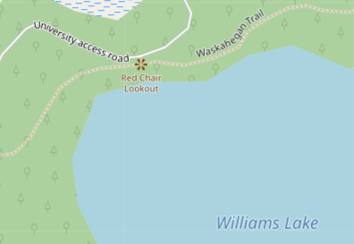
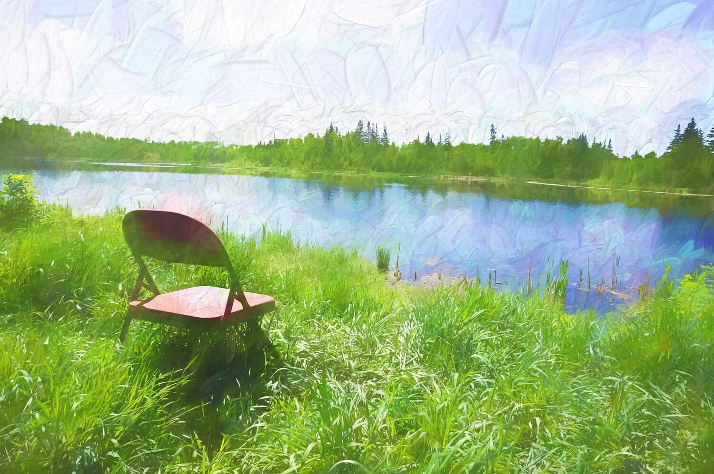
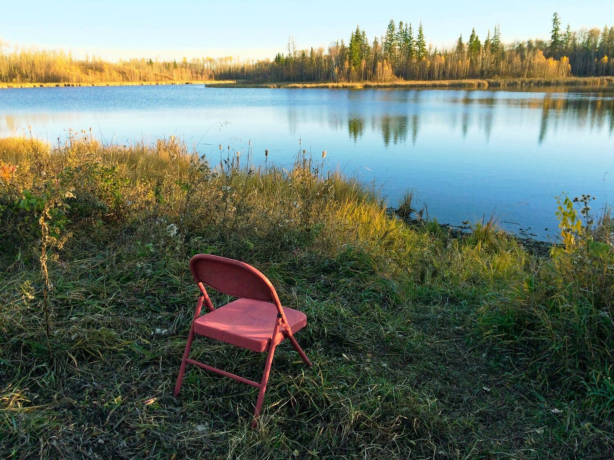
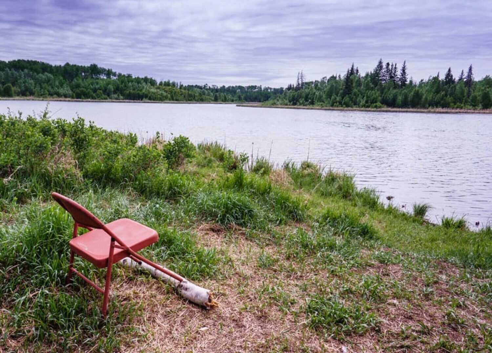
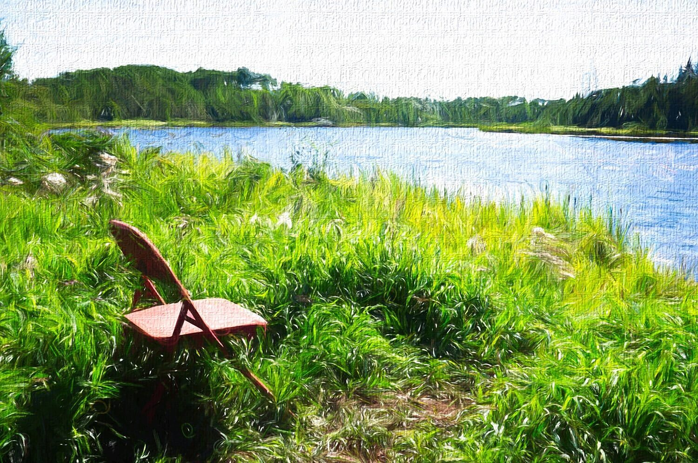
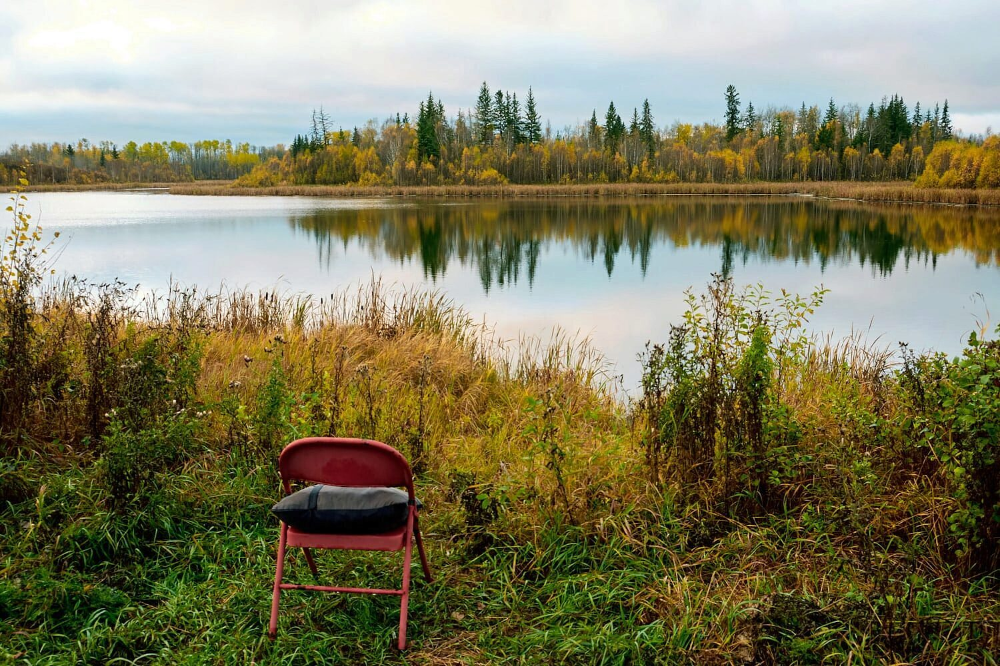
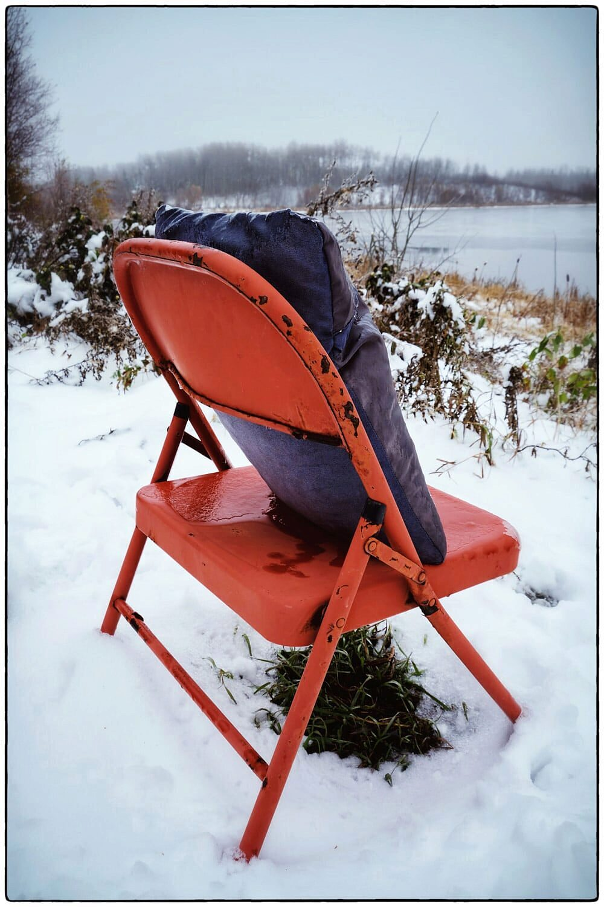
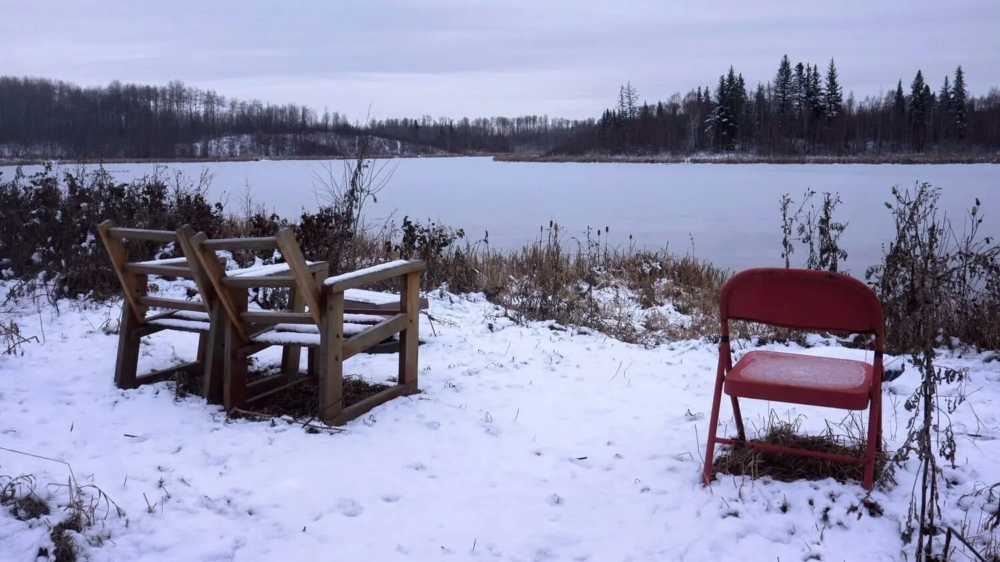
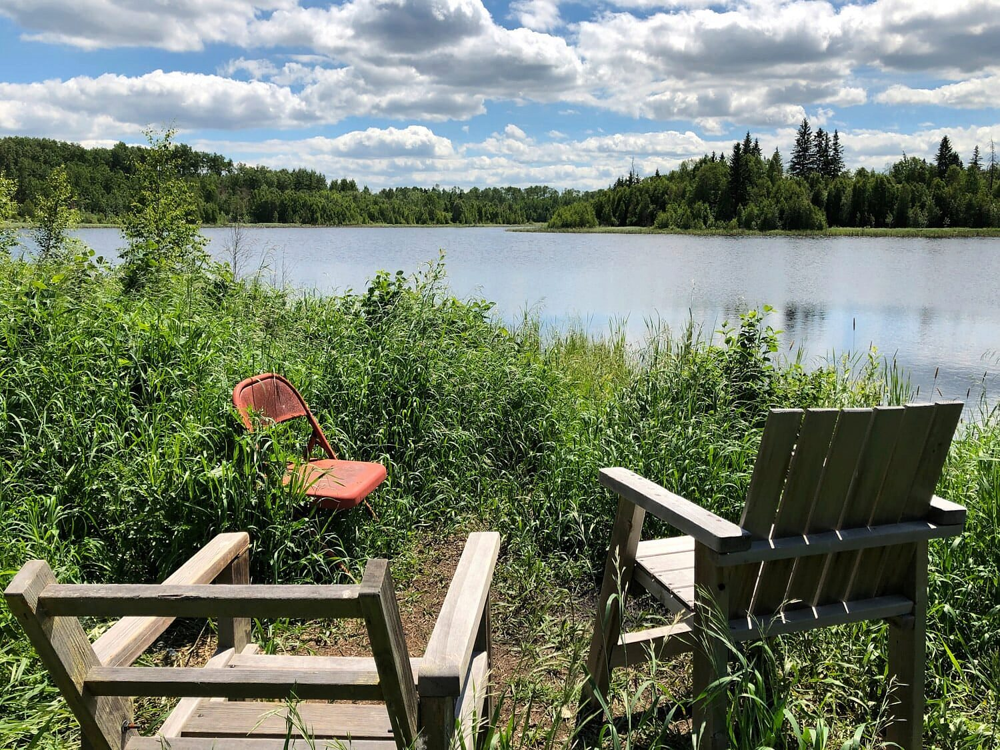

> “I only went out for a walk and finally concluded to stay out till sundown,  
> for going out, I found, was really going in.”  
> ― John Muir

The trails in the Ministik Game Bird Sanctuary are largely unmaintained, wild, and unpeopled. That's what gives the whole area its unique character and it's that character that keeps me returning to it time and again.

Experiencing a simple walk in a place like this really can help ease the mind into the "going in" that John Muir mentions in the quotation above. It's not guaranteed and it's often fleeting, but the transition to such a state seems to happen more easily in this kind of place.

There's evidence that others feel the same way. It's the urge toward the "going in" that caused one person to bring an "assist" to help with the process: a small, plain, folding red chair.

The Ministik is a big place with many trailheads leading into its interior. But I think it's fair to say the "front door" is a gate to a road that leads to a research compound owned by the University of Alberta.

And after a twenty-minute walk down that road one can climb a small embankment to arrive at a lookout over Williams Lake. It's a simple, beautiful scene.

For almost a decade now a small, red folding chair has been a constant sentinel at the lookout. The chair provides a place to sit down, slow down, unwind, and stay a bit longer as Muir decided to do in the quotation above. It's the chance to experience a "going in."

The red chair has been such an enduring fixture of the place that a local contributor to OpenStreetMap has labeled the place "Red Chair Lookout".

The red chair endures as something man-made in this ever-fluxing scene of grass, water and trees. Nature's cycle of growth, death and dormancy continues around it as it shifts positions, moved by humans who visit so they can perhaps reconnect with the unseen force powering the cycle, a force they intuitively know they too are a part of.

And before you read about it in the tabloids, I need to give you the honest truth about red chair: yes, it's true, it does have a checkered past. But don't judge it: I think you'll agree it was merely an unwitting accessory to a crime.

Returning from a hike in the Ministik, I once happened to meet a gentleman just he was leaving the lookout and it as it turns out he is person who brought the red chair to the lookout years ago. He had found in a spot elsewhere in the sanctuary where some n'er-do-well thieves has been burning the sheathing off of copper wire. Near the remains of the spent fire was ... the red chair.

Since this gentleman, who turns 82 this year, has been visiting the Ministik for four decades, it must have easily occurred to him to relocate the chair so as to put it to a more "upstanding" use at the lookout, far away from a life of crime. And people familiar with the spot are certainly glad he did.

## The Red Chair: A Retrospective Gallery  

I've made it a point to capture an image of the view and the red chair itself whenever I passed Red Chair Lookout. It's a kind of ritual that I think unconsciously pays homage to the urge to Muir's "going in."

All these images are post-processed to some degree and I've done that in an attempt to depict the constant beauty and eternal change that naturally takes place at at one small spot on the earth like this one.

As you'll see, other wooden chairs have joined the red chair at the lookout. Although their appearance was jarring at first, they too have come to settle in and belong.
### June, 2014

### October, 2014 - The cycle of the year is coming to a close

### May, 2015 - After extensive research and a full environmental review, new "anti-sinking" technologies are applied to the red chair's front legs.

### August, 2015 - A stylized memory - (It seems the batteries ran out on the previous "anti-sinking" gizmo. That's okay; the red chair can stand on its own.)

### October, 2016 - Someone has added a cushion to help prolong sitting sessions

### October, 2016 - Later in the same month, in harsher weather, the cushion is still here.

### November, 2016 - The wooden chairs have arrived and at first, a cold war.

### June, 2021 - Years have passed and the chairs are far more cordial

