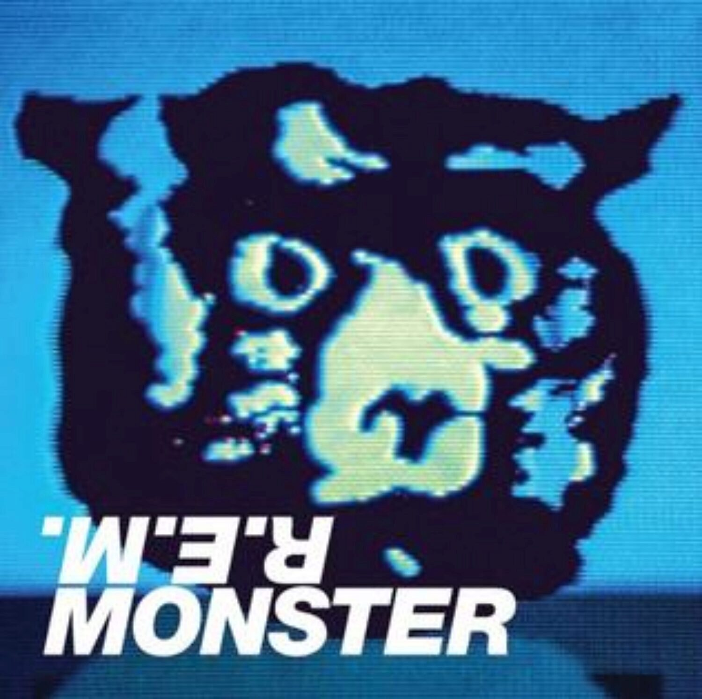

I'm working on developing tutorials for pieces of software that I think are outside-of-the-box cool. One example is [Knight Lab's TimelineJS](http://timeline.knightlab.com/).  For practice, I decided to create a Timeline of the studio albums REM released over the years. You'll find it  below, but first, why REM albums? They aren't a band I know and love from my youth. Nonetheless, their music has been infused into my brain and I doubt by brain will purge it. And that's a good thing; I like having their music rattling around in there.

Here's the thing: starting in my middle-age years, one thing led to another and it seems I just kind of gradually became an REM fan.

My first conscious memory of being aware of REM was while I was house-sitting in Cambridge Bay, Nunavut while I finishing up a 10-month teaching contract at Nunavut Arctic College. I discovered a cassette tape in the music collection of the people I was house-sitting for. It had a big blue dog on the cover. I think I may have been aware the album was by REM, but not knowing any better, I dubbed it the "Blue Dog" album.

Later I found out the album was called _Monster_, but the most important thing was that I really liked the music on it. What struck me about it was that no two songs seemed to sound the same on the album. That was different: usually bands have their "sound" and songs are simply variations on that sound. That's a overstatement, I know, but REM's sound was from all over the musical spectrum it seemed to me and that's what I liked about them. Obviously, these were musicians that didn't surrender to the path of least resistance and do the same thing over and over again.

In Feb, 2007, completely out of the blue I suffered a detached retina. After an emergency operation and some time healing, instead of driving I started to ride the bus to work from the suburbs to downtown Edmonton. Riding the bus and listening to music during the ride became a habit and it's during this time that I really began discovering REM catalog of music.

**In this Timeline I'm highlighting REM's studio albums and choosing one song from each of those albums that I like the most.**

<iframe src="https://cdn.knightlab.com/libs/timeline3/latest/embed/index.html?source=1ZIUomJYNzrKBI_GSh6OWRHtdVyOtVTcDUodLDwgCGIw&amp;font=Default&amp;lang=en&amp;initial_zoom=4&amp;height=650" width="100%" height="700" frameborder="0" allowfullscreen="allowfullscreen"></iframe>
