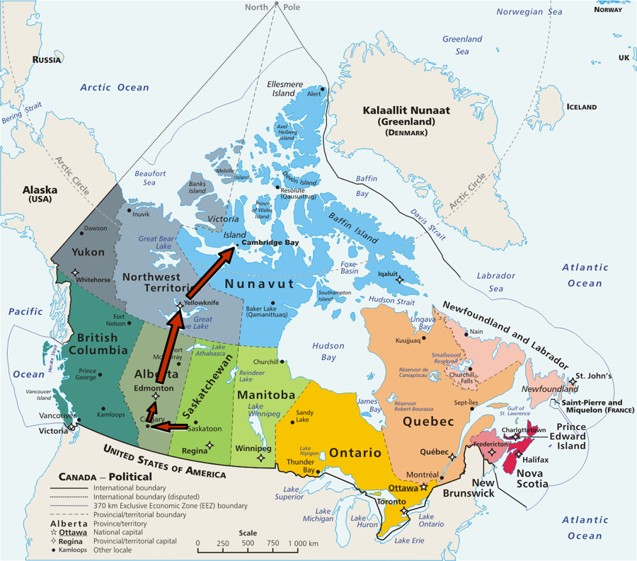
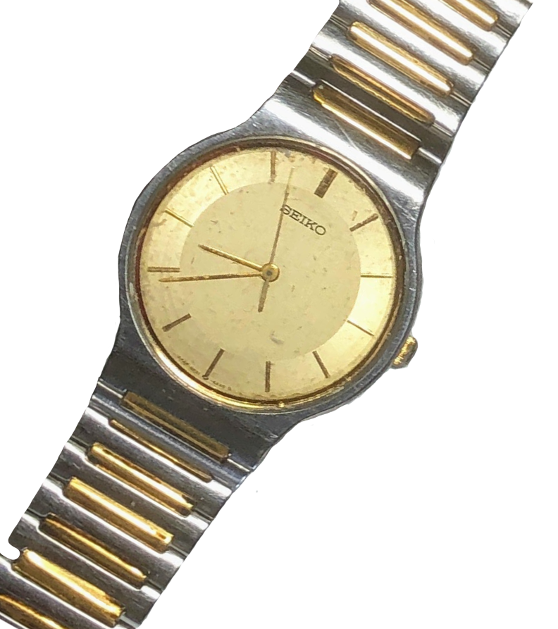

### My 2020 Commentary on this account written in 1998

I’d traveled into the unknown before. I still remember the leaving Saskatoon airport to travel first to Los Angeles on my way to Japan. That was a trip that took me into a decidedly different world.

Well, although I wasn’t leaving Canada, this trip was taking me yet again into a different kind of “other” world: to Cambridge Bay, a hamlet of about 1400 people, situated on a very large slab of tundra called Victoria Island just off the mainland of North America, and just inside of the arctic circle.

When you’re going to that kind of place, the trip seems memorable. This page on my Arctic Slice of Life website was attempt to describe that one day of travel. This post is quite text-heavy, not many pictures. After all, I didn't own a digital camera; they were expensive at that time. And besides, I was sitting in a plane for most of the day! 😀

### Introduction

This day was a special day because so much had been leading towards it for about two months. This was the day I got to stop TALKING about going north to work. This was the day I actually got on a plane and went to Cambridge Bay, NWT. (NWT = Northwest Territories, and the region of Nunavut was formed a year a after I left.)

I knew the day would be on one level filled with planes and waiting and lazy disinterested flipping of plane seat pouch magazines and newspapers. On another level it was a physical acting out of a passage into another life experience.That doesn’t happen too often in anyone’s life.

I had lived in Tisdale, Saskatchewan and worked at Cumberland Regional College in both Melfort and later Tisdale since February, 1988. Now in August, 1997, about nine years later, I was physically moving to another reality. The sinew connecting these two pieces of my life, nine years at Cumberland and the future, was this day long journey.

### The Flight

I started out for Cambridge Bay from the Saskatoon Ramada hotel at 4:45 a.m. to catch a 6:00 a.m. plane. I was packing five large bags, two hockey bag size stuffed with clothes, hard drives, some cutlery, towels, vitamins, etc., etc. This was the baggage I was allowed to bring on the flight, the excess being paid by Nunavut Arctic College, my new employer.

The trip north made for a long day. The trip from Saskatoon to Edmonton was made via Calgary all on a Dash-8, which seats about 30 people. This is a walk-out-on-the-tarmack, walk-up-the-steps-(turn around and wave one final goodbye to my public)-strap-you-in, give-you-peanuts-and-a-coke and now-be-quiet and don’t-ask-for-anything-else kind of trip. I think you get the picture.

I had about a 3 hour wait in Edmonton airport where I went through some very personal memories of a life turning point incident that once happened there. That’s all I have to say about that, and other than thinking about that I just walked around looking at people coming and going.

The flight from Edmonton to Yellowknife, NWT was on a 727 and we were given ready made ham and cheese sandwiches with dessert and coffee. (Note that FOOD will be a common theme/obsession for reporting throughout) This was better than the last flight but we’re not talking in-flight movie and an unlimited bar situation here, not that I crave that kind of thing.

Yellowknife is on the north shore of Great Slave Lake, my trusty En Route Air Canada magazine told me. There was a 2 1/2 hour wait there so I just lounged around the airport. La-dee-da.

The flight to Cambridge Bay was on a 737 and I began to notice (quick witted sleuth that I am) that there was something different about these NWT Air planes. I was in row 10 and found myself two seats from the front of the plane. "What's with this? I said. My spidey sense was tingling. Well the first class section of the plane was all converted into a cargo area. 



Now, people who have seen this a thousand times will laugh at this deep observation. This is in the "water is wet" category to people in the North. But when you think about it, the cargo is darn important here. Getting stuff to people is just as important -- and probably more lucrative for the airline if they are anything like trains -- as getting people to a place. And you generally don't have to serve peanuts and coke to cargo.

The assumption in the back of my mind was that I was travelling further and further into the boonies. Even if this was a pretty safe assumption, the food on this flight was best yet during my trip: chicken or stuffed pork was the choice. I throttled the urge to say "Both"! when asked what I wanted. I ordered the chicken and it was heavenly.

### The Happening

Now get this, because it's one of those Twilight Zone things. I happened to look at my watch a few time throughout the flight and just before we landed in Cambridge Bay, I noticed that my Seiko watch had STOPPED! Wow, big deal, you say. Well I have been wearing this watch almost every day for the past ten years! A good friend, Kinue Matsue, gave it to me as a going away present the day before I left Japan. That departure for me was an important time in my life. I was going back to Canada, to friends and family, but also to the unknown. Now, to begin this excursion to another "unknown," the watch stops. In a sense, it puts a bookend on that portion of my life.

Am I reading too much into a stopped watch? Maybe. Probably. But my first gut reaction was

nee, nee, nee, nee,

nee, nee, nee, nee,

nee, nee, nee, nee.

This is a sad attempt to type out the Twilight Zone theme. I will stop for a moment while you do it OUT LOUD. Isn't this internet thing cool: you can get multimedia sound and everything!

So this was my trip to Cambridge Bay. Exciting? Boring? Thought provoking? Mind numbing? Yes, that day of travel was all of those things to me.
