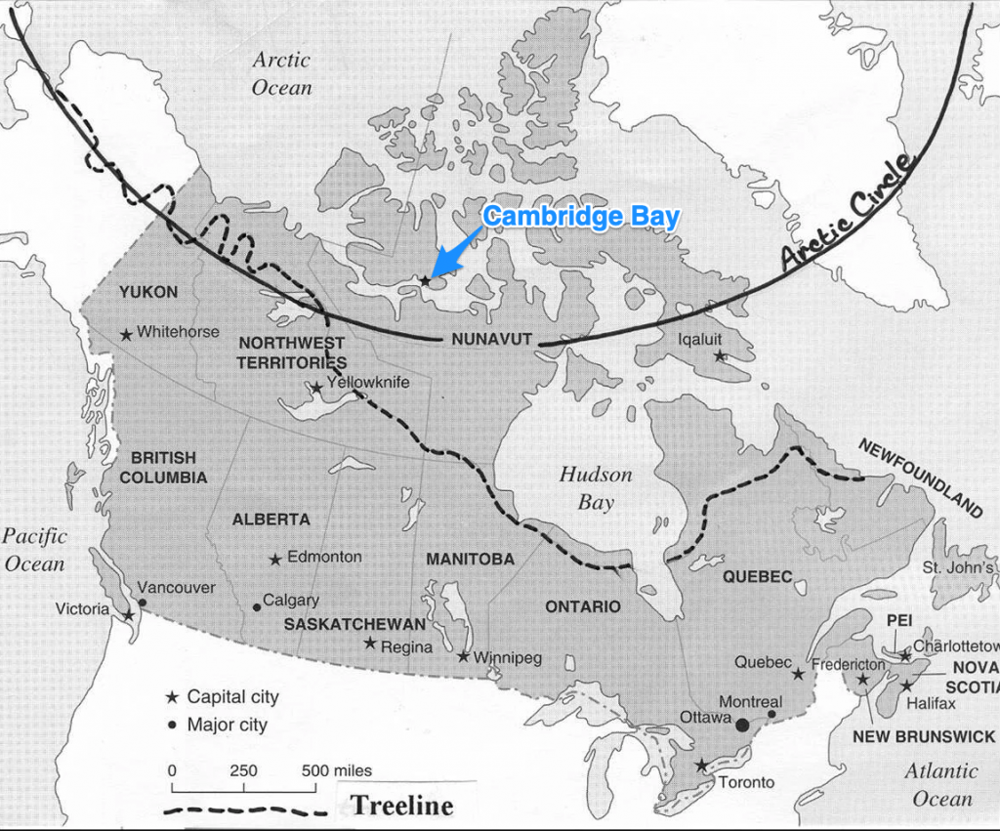

### So, Where is Cambridge Bay and What Does it Look Like?

")

On August 25, 1997, I got on a plane bound for Cambridge Bay, Nunavut (then still the Northwest Territories).

Why was I going? In short, after nine years of working at a regional college in northeast Saskatchewan, I’d decided it was time for a change in my life. And in retrospect, when I’ve made changes in my life, I’ve often made fairly dramatic changes. This was one of those dramatic changes. 

Sure, to make a job change, I guess I could have waited for a smaller swing of the life pendulum to come my way, but the opportunity presented itself in the form of a job posting in the coffee room of one of the College offices one day while I was visiting. I’d been contemplating making a change for a good while already and the prospect of working in a place so alien to my experience seemed like an adventuresome way to make the break into something new and different.

I remember doing a phone interview while sitting on floor of my living room, using the coffee table Japanese [kotatsu](https://en.wikipedia.org/wiki/Kotatsu)\-style. I remember thinking the interview went well. I also remember my Dad pretty much trying to talk me out of considering the move: “It’s probably a case of anyone who puts their hand up will be chosen to go up there,” he said. I didn’t know if there was any truth in that then, but I was determined to make a change so it’s probably quite obvious by now I was offered the job and I decided to accept the offer. In retrospect, I should say that my Dad was probably right. Nonetheless, I’m glad I followed the that path, despite the negative aspects of living and working in such an isolated environment, which I’ll get into in later post in the series.

So I made my exit from the regional college, leaving nine years of experiences, work relationships and relinquishing my position of number two on the union seniority list. And I was eventually on my way to Cambridge Bay.

### So, Where is Cambridge Bay, Anyway?

The hamlet of Cambridge Bay is situated just off the North American mainland, on the  southern part of Victoria Island. This unique  map shows where Cambridge Bay is in relation to both the arctic circle and the northern edge of the tree line to the south.

The definition of the arctic circle is well known: it’s the point where “the Sun is above the horizon for 24 continuous hours at least once per year (and therefore visible at midnight) and below the horizon for 24 continuous hours at least once per year (and therefore not visible at noon)” (_[Source](https://en.wikipedia.org/wiki/Arctic_Circle)_)

The idea of the “tree line” may not be so well known. Just like at the tree line of a mountain where you find trees won’t grow at high altitudes, the environment north of the dotted line on the map will not sustain full-grown trees, although shrubs may grow sparingly just north of the line. Once you get as far the latitude of 69 degrees north, where Cambridge Bay is, there are no trees of any kind.

Having been born and raised in Saskatchewan, I’ve endured the comments and misconceptions of temporary visitors or “non-visitors” to the province: that the whole place is flat and treeless. That may be largely true in the southern part of the province along the Trans-Canada highway. But “my Saskatchewan” isn’t like that at all. I happened to have grown up about a 45 minute drive from the tree line in north central Saskatchewan, meaning north of that line (and extending north to the dotted line you see in the map above) there are **nothing but** trees. 

Since “my Saskatchewan” was very well-forested, it was certainly a adjustment to see the absolutely treeless and even shrub-less landscape surrounding Cambridge Bay. Was it a surprise or a shock? No, not at all, but it was an adjustment, no question.

### Want to Learn a Bit More?

For more history and information about Cambridge Bay, check out the Wikipedia article about the town. [https://en.wikipedia.org/wiki/Cambridge\_Bay](https://en.wikipedia.org/wiki/Cambridge_Bay)
