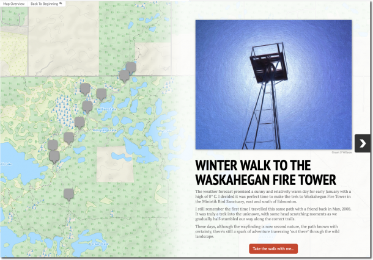
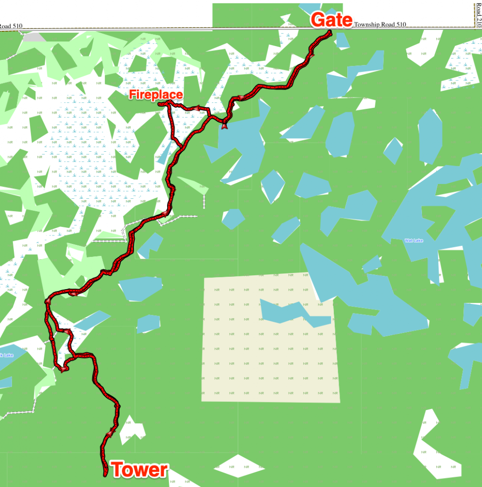

<base target="_blank">
It was a beautiful, clear day on Sunday, January 5th, when I decided to take a winter walk in the Ministik Bird Sanctuary starting at the U of A access road gate with the final goal being the Waskahegan Fire Tower. Along the way I stopped at some key waypoints and took photos with my seldom-used 360 camera, a Ricoh Theta SC.

I thought I'd share the experience using some software I'm trying out:

- [Knight Lab StoryMapJS](https://storymap.knightlab.com/ "Knight Lab StoryMapJS") which displays a map along with media like images or video in a slide format, and
- the [Kuula](https://kuula.co/ "Kuula") image sharing site for the first time. There's a 360 image hosted on Kuula on each slide in the StoryMap and the images were sometimes slow to load. Please have patience.
- Also, if you see a "play" button on the image, click it to load the 360 image, then use your mouse to drag the image around. And I have to say all of this is **much better experienced on a computer screen vs a smaller mobile screen**.

Sharing the trip experience in this way is a bit of an experiment, so if some of it doesn't work out, well, I'll just chalk it up to science. 

**Click the image below to launch the StoryMap in a new browser window.**

### My Route Today

