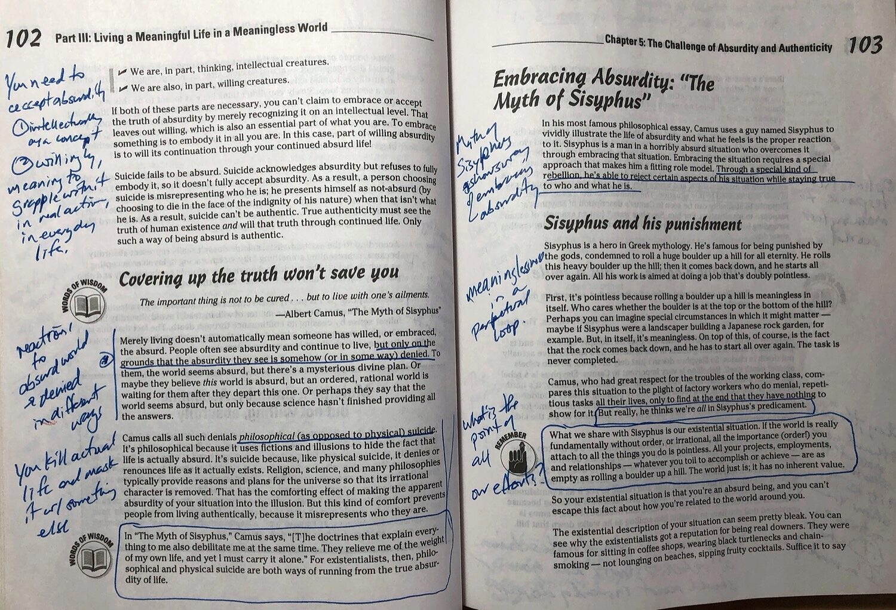
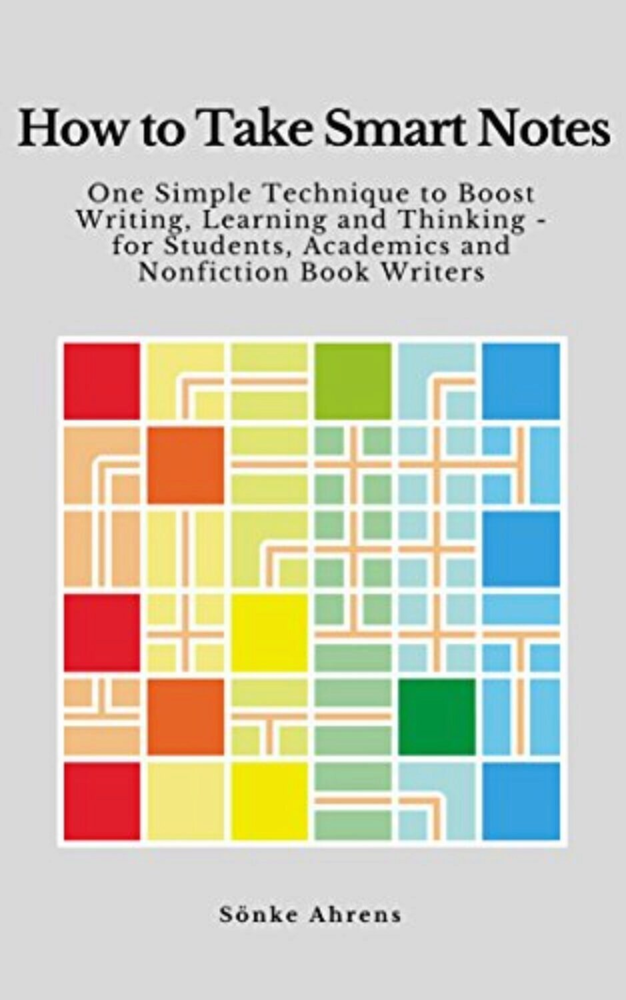

Do you love learning new things?

Yeah, me too.

But if you think about it, you’re not going have someone answer that question with, “Not me! Learning’s just not my thing!” You won’t because humans simply like to learn new things. It’s in our nature.

That said, I think you’ll agree that there are differences in the _effort_ different people put into constantly learning new things. Doing **that** isn’t easy. Constant learning means challenging the mind-constructed comfort zone of one’s current world view. It means taking a risk to learn, test and absorb new ideas that ultimately change that worldview. And while all that is happening one is very likely to feel a bit lost, a uncertain and maybe a bit stupid. All that can can be uncomfortable, scary even.

And if you’re really serious about making a habit of learning new things, I think you’ll agree that you’ll want to be just as serious about doing whatever you can to first, retain that learning and second use it to change how you think, do and act in the future.

In the recent past when reading a book to learn from - as opposed to pure pleasure-reading -  I thought I was doing all I could to retain the ideas I’d gleaned.

For example, I knew I’d learn best if I was actively engaged with what I was reading. That usually meant having a pen in my hand - or a highlighter - to mark passages that seemed to most important. Comments or questions would be also be scribbled in the margin.

Sound familiar?

Underlining and making marginal notes is a good habit, but it only goes so far if you want any learning you've done to last

In my opinion this method of interacting with the material should be second nature. If it’s not, I would whole-heartedly suggest you get a pen in your hand while you read a book or learn from any other content source like a blog post, movie, podcast, and so on. 

To be honest, even though I’d done that work, I found myself opening up a book I’d read a few months before to see the text marked with underlines, and the margins dabbled with scribbles, and any learning I’d done back then was pretty well completely forgotten.

What was the point of all that, if I was just going to forget it all anyway?

## The Promise of a Better Way

Before you continue to underline text and scribble in the margins, consider another way of engaging with the content you’re reading. It’s a method that’s gotten quite a lot of buzz during the past few years and I’ve just started to wrap my brain around it recently. I’m not going to say the method promises an **easier** way of learning and remembering, but I honestly believe it has the potential to be a much more effective on both counts.

It’s called the _Zettelkasten_ method. 

I know what you might be thinking: that I’m going to tell you it was invented by someone named Baron von Zettelkasten in the late 1800’s in Bavaria. But no, there are no over-sized moustaches and faded portraits of spikey-helmeted German barons involved here.

It’s a lot more basic than all that. _Zettel_ is simply German for “note” and _kasten_ translates as “box”. Literally, “Note-box”. _Zettelkasten_ is generally translated as “slip-box.” Frankly, this is not a word I remember ever using in English. I would more likely call a “slip-box” a small version of a card catalogue, you know the kind you used to see taking up most of the first floor of any library in the “olden days” before computers.

But what does a “slip-box” have to do with a different way of learning?

First, let’s go back to the underlined text in the books you’ve read. That underlined text and the scribbles in the margin are all that remain from the time you decided which passages were the most important in the book. When you made those marks in the book you were engaged with the ideas it was describing. But that time has passed.

When you close the book the learning experience gradually washes away from your memory. Be honest, despite your hard work and maybe an A on an exam, that’s what happened. This is simply the way things are if you rely solely on this technique of learning.

Sure, you can can go back to the book and now it’s easier to zero in on what you seemed to think was important. But close that book and in a couple of sleeps, poof, it’s all gone again. It’s like some perpetual, evil magic trick.

Sönke Ahrens, the author of _How to Take Smart Notes_ points out this problem: merely underlining sections of text and writing the odd comment in the margin will very soon become useless to you. He has alternative method. It may not be **easier**, but in his opinion - and mine, I’ve decided - it many times **better**.

Ahrens says that instead of merely underlining text, you have to do something with important ideas you’ve gleaned from the book and the _Zettelkasten_ method tells you exactly what to do.

First you should have a pen in your hand and make what he calls “Literature Notes”. Since his book is primarily aimed at an academic audience, the word “Literature” means the collection of research amassed on a certain subject. I prefer calling these “Raw Notes”.

Notice I didn’t say that you “take” notes; no, you’re expected to **make** the notes, that is, reword or translate the ideas you learn into your own words as you make notes on the content. This forces you to interact with the material, question your understanding of it, and look for ways to fill any gaps in that understanding as you go. Now you’re both engaged and thinking about the content.

Eventually, you will be archiving these “Literature Notes” so it’s important that you’ve captured as much as you can from your source, be it a book, an article, blog post, or YouTube video, and so on.

Either while you’re taking these “Literature Notes” or soon after you’ve finished, you then make “Permanent Notes”. These are the notes that Niklas Luhman, the original developer of the Zettelkasten method, would add to his slip-box on what we would call index cards.

Examples of Luhman's "Permanent Notes". These would find a permanent home in his _Zettelkasten_ (Slip-box

Permanent notes have some unique qualities. They are “atomic” in that they describe, as briefly as possible, a fundamental, core idea or concept. They are written in full-sentences so that it stands on its own, meaning the note should be able to be understood by you or anyone else outside of the context from which you just extracted the idea.

Put another way, you write this note for an audience of one: your future self, who will inevitably forget the concept and having ever written the note in the first place.

Already the demands of this method are “forcing” you to think, grapple, and question with ideas and concepts in two different passes, first when creating “Literature” notes and second, when creating “Permanent” notes. Compare this to simply underlining words in a book. I think you’ll agree that while this method is more demanding, it will certainly lead to a greater understanding of whatever it is you’re trying to learn.

That said, the real power of the system comes with the next step: saving your Permanent Notes in slip-box system and linking those ideas to others already there. 

When Luhman undertook this step, he used a system of numbers to identify each and every new note he added to the system. It allowed for chains of related ideas to form and because the notes were “self-contained” it also allowed for ideas to be connected to other notes no matter where they were stored in his slip-box. 

But, yikes, that sounds like a lot of tedious work, doesn’t it?

## Software Makes the _Zettelkasten_ Method Far Easier

These days the idea of “hyperlink” from one document to another is second nature to us and linking notes together is extremely easy with the right software.

Web-based [Roam Research](https://roamresearch.com/) has produced a lot of praise for its ability to store and link notes, but it comes with no free option and at what I personally consider too steep a subscription price at $US 15/ month or  $US 165/ year. It is housed entirely online and so there’s always a nagging question about the status of the content you create with the software.

The relatively new [Obsidian](https://obsidian.md/), a free, open-source option, offers similar features, but runs locally in a stand alone application on your computer. It also stores files locally so you always know exactly where your work is. There are many options for safeguarding your work and storing inside a file sharing and syncing service like Dropbox, iCloud, or OneDrive are popular choices. I happen to have simple Network Attached Storage device so my "vault" of notes is kept there and accessible from any computer in the house.

Like Roam, Obsidian uses Markdown exclusively so you can add formatting to your text similar to HTML (bold, italic, bullet points, etc), images and other HTML tags if needed.  Since Markdown has become a standard import / export format for many applications, and files are stored in text format, your work is extremely portable and future-proofed. [Learn more about Markdown if it's new to you.](https://www.markdownguide.org/getting-started/)

There are other promising applications like [Remnote](https://www.remnote.io/), [Tiddlywiki](https://tiddlywiki.com/), [Stroll](https://giffmex.org/stroll/stroll.html),  and [org-roam](https://www.orgroam.com/) which I’ve only poked at in passing.

I’ve personally decided to climb the Obsidian learning curve and I’ll use it to save and link any notes created while reading (books, blog posts), listening (podcasts) or watching (YouTube, Vimeo).  Obsidian’s features are impressive even though it’s still relatively early days in its development: at this writing, it hasn’t yet reached the version 1 status yet.

At this point, I’m still a _Zettelkasten_ newbie. I’ve got the theory down but I honestly don’t yet have much experience actually working to create, link and think through a significant number of linked notes.

I’ll be sure to add new posts in the future describing my software of choice Obsidian and my experience working with it in the future.
